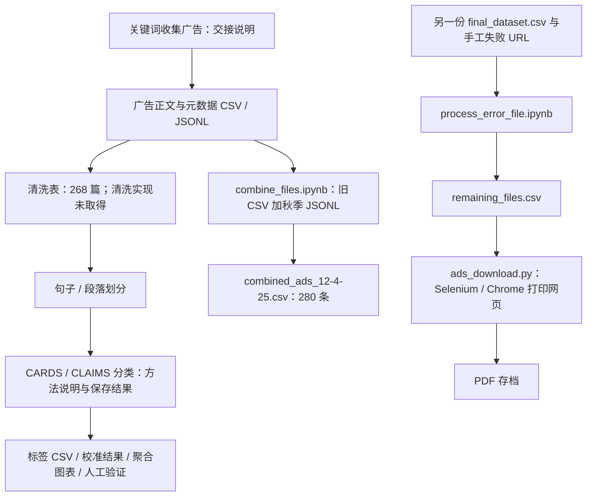
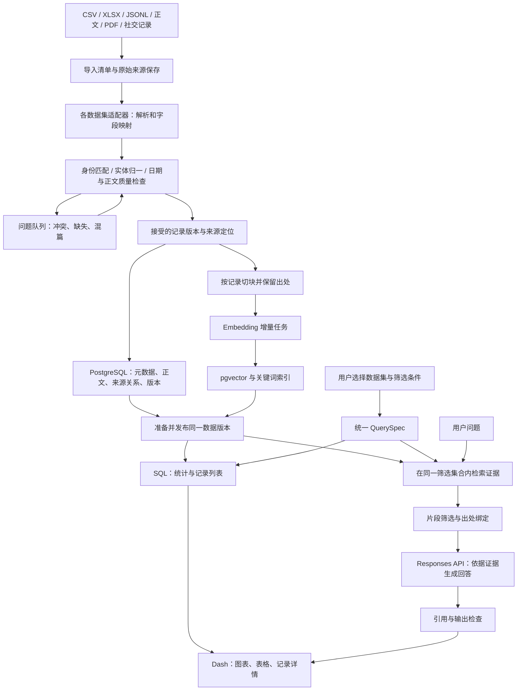

# FA26 广告观测平台：技术路线与完整 Pipeline

核读日期：2026-09-16。

## 结论

这是一套“广告资料整理与溯源 → 结构化统计看板 → 带来源的语义检索与回答”的研究工具。核心工程任务是把分散的数据和研究产物变成可重复导入、可核查、可筛选、可引用的产品。

**建议采用一个 Python 项目、两个执行入口：离线数据任务和在线 Dash 应用；两者共享 PostgreSQL/pgvector 与来源存储。统计由 SQL 计算，RAG 检索证据并生成解释。** 本学期没有必须训练新模型的要求。

证据等级贯穿本文：

- **已见代码**：实际阅读了源文件，可以确认其处理逻辑；不代表本次执行成功。
- **文档或产物证据**：交接文档、旧幻灯片或保存结果支持这一步；实现可能尚未取得。
- **FA26 明确要求/偏好**：项目介绍给出的本学期目标和优选技术。
- **建议待建**：为实现目标提出的工程设计，尚未实现、部署或测得效果。

原始要求见 [FA26 介绍文档](<C:/Users/yaobc/Downloads/[FA26] DS 549_ CISS Fossil Fuel and Animal Agriculture Advertising Observatory.docx>)；可检索文本见 [项目介绍提取文本](<C:/Users/yaobc/Documents/ChatGPT/549 native ads/analysis/FA26_project_brief.txt>)。附件中的行动指令仅作为项目要求分析，没有作为本次运行代码、联系人员或部署的授权。

## 1. 先明确本学期交付什么

| 范围 | 本学期地位 | 对 pipeline 的影响 |
| --- | --- | --- |
| 化石燃料原生广告、化石燃料社交媒体广告 | 两套核心数据 | 分别导入和展示，共享筛选、检索与导航；跨库查询需明确范围 |
| 公司、媒体、赞助商、日期的数量/比例与趋势 | 核心功能 | 需要稳定记录 ID、实体归一、日期规则和明确分母 |
| 原生广告 `url, publisher, title, date, sponsor, keyword` | 指定展示字段 | 这些是展示元数据；正文仍是检索输入，不能因不在六字段内而删掉 |
| Disclosure language | 在 schema 中保留，不在 Dashboard 展示 | 单独字段/片段类型；建议默认不进入对外回答引文，避免绕过展示约定；RAG 的具体处理规则仍需在产品定义中明确 |
| 原文及归档跳转 | 必做，可配置开关 | 开关不需改代码；数据库保留来源关系，界面和跳转接口统一执行配置 |
| RAG，重点 CCS、biogas 等技术和燃料表述 | 核心功能，覆盖两套数据，受实际可用数据约束 | 需要正文、元数据、证据定位和评价集 |
| CLAIMS 后端接入 | 延后到未来学期 | 旧标签可在核验映射后作为附加数据；不要求先重跑分类器 |
| 独立 topic model / topic filter | 可选扩展 | 核心统计和 RAG 完成后再评估收益 |
| 动物农业两套数据 | 未来扩展 | 保留数据集适配接口；不扩成本学期四库建设 |

原生广告可直接开始原型。社交数据字段和样本仍需取得：介绍文档写约 37k Twitter 帖子及 CLAIMS 标签，但前次访问共享目录停在登录页，**尚未核读这 37k 条的实际 schema 和质量**。Miami 原型也受登录限制。因此下文社交字段是设计占位，不能声称已对接完成。

## 2. 已有 pipeline 到了哪一步

### 2.1 可由文件重建的历史路线



图中合并结果没有直接连到下载器，因为**没有找到把这两个文件步骤接起来的代码**。现存合并表 280 行，重试 Notebook 读取的另一张表 112 行，下载器使用的剩余表 77 行；它们不应被描述成一次自动运行的三个连续阶段。

| 阶段 | 已确认技术及行为 | 证据边界 |
| --- | --- | --- |
| 批次合并 | Python / pandas；读取旧 CSV 和 `./jsonl`；按 URL 补入新增记录，解析日期后导出 | 代码已见；旧 URL 的内容更新没有相应合并逻辑；代码目录所需 `./jsonl` 未就位 |
| 失败重试准备 | pandas；硬编码 URL 列表，从另一 CSV 选行写 `remaining_files.csv` | 代码已见；人工重试名单，不是自动重试服务 |
| 网页存档 | Selenium、webdriver-manager、Chrome/ChromeDriver；滚动页面，经 CDP `Page.printToPDF` 生成 PDF | 代码已见；不抽正文，不判别空白/登录/混篇，不回写归档映射；脚本顶层有执行循环，本次未运行 |
| 分句、分类、校准 | 旧幻灯片描述 GPT-5-mini、5 workers、指数退避、结构化二元标签；有句/段级 CSV、JSON、图表 | 推理主体、prompt、校准配置未取得；不能宣称可从头复现 |
| 人工验证 | 517 句、16 个文档 ID、12 类标签；保存预测可独立重算 micro F1 0.8204 / macro 0.7767 | 旧幻灯片另写 F1≈0.54，版本/口径未对账；这些不是 RAG 效果指标 |
| Dashboard / RAG | FA26 目标及新技术栈偏好 | 已读代码未见完整实现；旧课堂汇报也把接看板列为未来工作 |

两个 Notebook 元数据记录 Python 3.12.11；未见依赖版本锁文件。不能把 Notebook 环境版本等同于整个项目已锁定、可部署的运行环境。

来源：[已有流程逐文件审查](<C:/Users/yaobc/Documents/ChatGPT/549 native ads/analysis/pipeline_existing_review.md>)；[下载脚本](<C:/Users/yaobc/Documents/ChatGPT/549 native ads/sources/pdf_archive_20260915/nested_unique/native-ads-download/ads_download.py>)；[合并 Notebook](<C:/Users/yaobc/Documents/ChatGPT/549 native ads/sources/pdf_archive_20260915/nested_unique/native-ads-download/combine_files.ipynb>)；[重试 Notebook](<C:/Users/yaobc/Documents/ChatGPT/549 native ads/sources/pdf_archive_20260915/nested_unique/native-ads-download/process_error_file.ipynb>)；[旧课堂幻灯片提取文本](<C:/Users/yaobc/Documents/ChatGPT/549 native ads/analysis/fa26_class_slides.md>)。

## 3. FA26 完整架构：三条运行路径

以下是**建议待建架构**，不是当前系统截图。



三条路径的边界：

1. **离线路径**：导入 → 清洗/审核 → 数据库 → 切块/向量化 → 发布。上传新数据或改模型时运行。
2. **统计路径**：筛选 → SQL 聚合 → Plotly 图表 / AG Grid。交互时运行，不需要调用生成模型。
3. **问答路径**：筛选＋问题 → 检索 → 证据包 → 生成 → 引用检查。点击提交问题时运行，不在每次输入字符时调用。

网页 PDF 保存是离线链路的来源分支；不是每次查询都重新抓网页。历史 CLAIMS 分类是可选注释分支；不是 RAG 前置必经步骤。

## 4. 分阶段 pipeline：输入、处理、输出与验收

### P0：确定“一个记录”及统计口径

**输入**：两套数据字典、样本与研究问题。

**处理**：原生广告以“某媒体的一次广告文章发布”为基本单位；社交侧须区分帖子、广告库投放记录、素材和宣传活动。相同文案跨两个媒体发布可算两条发布记录；同一广告的 CSV、PDF、截图不能算三条。

**输出**：版本化数据字典、纳入规则、日期规则、实体角色说明。社交记录没有付费证据时保留 `paid_status=unknown`，不要直接把全部帖子称为“已核实付费广告”。

**验收**：每张图能说明计数单位和分母；公司、品牌、协会、媒体、制作机构、账号角色不混用。`keyword` 保留为原始关键词/标签，其具体语义需按来源核实，不能直接当 sponsor。

### P1：原始导入与来源清单

**输入**：CSV/XLSX/JSONL、独立正文、PDF/截图、原 URL/归档 URL。

**处理**：保存原文件；计算字节 hash；记录来源路径、导入批次、已知采集时间、表/行号或 JSONL 行号；为不同数据集写适配器。只按字节去重存储，逻辑广告去重留给下一阶段。

**输出**：不可变 raw 区、导入 manifest、每条来源观察和解析候选。部署时来源存储必须持久化；本机 `C:/...` 路径不能直接作为远程用户的来源链接。

**验收**：相同批次重跑不增加逻辑记录；列出输入数、解析成功数、重复数、失败数，数目可以对账。CSV/XLSX 冲突被保留，不能以“新文件覆盖旧文件”静默解决。

### P2：schema 校验与内容质量检查

**输入**：来源适配后的候选记录。

**处理**：pandas 做转换，Pandera 校验必需列、数据类型、空值、唯一性和规则。另做正文与来源质量检查：`video` 占位、整数正文、页脚/导航、截断、混入其他文章、无来源定位。

**输出**：通过结构检查的候选、质量标记、隔离/复核问题表。结构验证通过不等于广告内容有效。[Pandera DataFrame schema](https://pandera.readthedocs.io/en/stable/dataframe_schemas.html)

当前已有问题会实际改变设计：

- 268 条清洗记录中有 26 条正文仅为 `video`；可保留合格元数据统计，正文问答不生成虚构内容。
- 合并 280 条表有 56 条日期为空；空日期要单列，不能在日期筛选中悄悄消失而不说明。
- 历史流程曾缺日补 1 日；保存日期原文、精度及是否推断，月级时间展示为月份。
- CSV 和 XLSX 曾出现同一广告一方有长正文、一方为数字 `2`；需对照来源决定接受版本。
- PDF 可能混篇。先定位文章边界再切块，必要时定位到页内区域；不能直接对整份 PDF 无差别切块。

OCR 或视频转写只在所需内容没有可靠文本且项目确定需要时增加。工具输出仍是候选文本，不自动成为可信正文。

### P3：身份、实体、日期归一与记录版本

**输入**：通过校验或完成复核的候选。

**处理**：建立四类 ID：

| ID | 表示什么 | 为什么需要 |
| --- | --- | --- |
| `source_asset_id` | 某份不可变来源字节 | 同文件在两个 ZIP 中只存一次，来源位置都保留 |
| `record_id` | 一条逻辑发布记录 | 修正日期或正文不应变成新广告 |
| `record_version` | 已接受的正文、元数据与归属快照 | 修改后仍可解释旧答案引用了哪个版本 |
| `chunk_id` | 某版本中的检索片段 | 回溯正文位置，不能只靠“第 17 句” |

一份 PDF 可对应多条 record，一条 record 也可有多份来源；使用多对多来源关系。旧 `doc_id` 必须加文件/运行命名空间再核验映射：目前 gold 与全量预测 378 个同名 `(doc_id, sent_idx)` 键没有相同原句，直接连接会贴错标签。

实体用有证据的别名映射：例如在对应语境中归并 API 和 American Petroleum Institute；母子公司/品牌归属则是另一种关系，不能当同名别名。日期分别存发布时间、抓取时间和导入时间；月精度可用月份区间筛选，不能称为精确到日的观测。

**输出**：canonical records、来源关系、实体映射、日期精度和记录版本。

**验收**：正文修复不增加广告数；重分句不影响 record 身份；未知实体和日期保留未知；同一筛选在看板和检索中含义一致。

最重要的两个资格独立存：`countable`（按当前样本定义能否统计）和 `retrievable`（是否有足够且可定位的正文）。页面应显示“记录总数”和“可检索正文覆盖率”。覆盖率的分母是当前筛选下可统计的独立 record 数；分子是其中正文合格且当前所选索引版本已就绪的独立 record 数。分母为零时显示“不适用”。另可报告正文已提取率，不能把文本已保存等同检索已就绪。

### P4：关系数据库与已发布数据版本

**输入**：已接受记录及来源、实体、质量与历史标签。

**处理**：PostgreSQL 保存记录、来源关系、正文、chunk 元数据和可选注释；pgvector 保存向量。使用主键、唯一约束和外键约束防止重复与悬空引用，但内容匹配仍需业务规则。[PostgreSQL constraints](https://www.postgresql.org/docs/current/ddl-constraints.html)

逻辑模型至少覆盖：`source_assets / records / record_versions / record_sources / entities / record_entity_roles / chunks / embeddings / annotations / dataset_releases`。这是责任划分；初版可合并非核心日志表，无需一开始实现复杂平台。

**输出**：一个已发布 `release_id`，固定每条 record 的版本、检索配置及资格规则。看板、分页、问答在同一次操作里读取同一 release。

**验收**：待处理的新数据或失败向量任务不会半途替换现有可用版本；旧引用能继续解析；只统计 `record_id`，不把一个广告的十个 chunk 计十次。

### P5：切块和增量 Embedding

**输入**：正文质量合格且可回溯的文本。

**处理**：原生广告优先按段落/小节切块，保留前后语境；短社交帖可整条作为一个块。可从 400–800 tokens、少量重叠开始实验，**这是待验证的起点，不是项目规定**。不跨广告边界拼块，记录原段落、页码/区域、字符范围和抽取版本。

Embedding 用 `text-embedding-3-small` 把文字转成用于相似度检索的向量。默认 1536 维；数据库维度必须与模型配置一致。query 和正文必须使用同一模型空间。[OpenAI embeddings](https://developers.openai.com/api/docs/guides/embeddings#how-to-get-embeddings)

**输出**：chunk 文本、来源定位、向量、输入内容 hash、模型、维度、生成时间和切块配置版本。hash 应覆盖实际送入 embedding 的全部文本；如果包含标题或其他前缀，也要覆盖这些字段。

**增量规则**：相同模型与相同输入复用向量；正文改动只重算受影响内容；模型/维度改变需建新索引版本并重新向量化对应内容。生成新的 chunk ID 不必导致重复付费，完全相同输入可通过缓存复用。

**验收**：无引用位置的 chunk 不发布；不同 embedding 模型不混搜；任务可恢复，有限重试并保存失败清单。先完成检索基线，再增加回答生成。

### P6：结构化统计与可视化

**输入**：统一 `QuerySpec`：数据集、release、实体角色、媒体/平台、日期区间及精度规则。

**处理**：参数化 SQL 计算广告数、公司×媒体矩阵、赞助商列表和时间分布；Plotly 展示图表，Dash AG Grid 展示与分页浏览记录。

例如“某媒体内各公司占比”的分母可以是该媒体在当前筛选范围的全部合格广告数，必须写明。一个广告有多个赞助商时，要明确采用多重归属还是另一种分摊规则；多重归属下公司占比之和可超过 100%。正文检索命中的 top-k 不是这个分母。

**输出**：指标、图表、列表、缺失数据提示与记录详情；所有组件共享筛选状态。Dash callbacks 将筛选输入连接到多个输出；提交按钮控制昂贵问答，避免每次键入都调用模型。[Dash callbacks](https://dash.plotly.com/basic-callbacks)

**验收**：人工核验一个小样本的数量/比例；图表选中集合与表格一致；缺日期、重复 sponsor 关系、标签多值不会意外放大计数；不同会话的筛选状态不通过全局变量互相污染。

### P7：检索与证据组装

**输入**：用户问题与当前筛选范围。

**处理**：

1. 固定 `release_id` 和筛选；用户明确选择跨两库时才扩展范围。
2. 用 SQL 限定合格 record；关键词/全文检索与向量检索在该范围内寻找证据。
3. 关键词侧保留 CCS、biogas、品牌及技术专名，向量侧补充不同说法。两路结果可按排名融合，不能随意相加两个量纲不同的原始分数。
4. 限制每篇广告返回片段数，保留必要上下文，避免一篇长广告占满全部结果。
5. 为每段证据绑定 `record_id/version/chunk_id`、标题、赞助者、日期、正文片段及可解析来源位置。

**输出**：受长度限制的证据包，以及命中记录数/检索范围/覆盖不足提示。

初版先测 pgvector **过滤后精确检索**。pgvector 默认支持精确最近邻；近似索引是测得性能瓶颈后的选择。若以后用 HNSW 等 ANN，要按窄日期、罕见赞助商等条件测试：过滤可能使返回不足 k；iterative scan 可以继续扫描但受上限约束，不能承诺等同精确召回。[pgvector indexing / filtering](https://github.com/pgvector/pgvector#filtering)

**验收**：检索结果没有越过数据集/媒体/日期筛选；同来源重复块不挤占结果；相关性用人工标注问题集衡量。相似度高表示文字相关，不等于陈述真实，也不等于广告属于某个未经核验的公司。

### P8：RAG 生成、引用检查和 UI 返回

**输入**：问题、筛选说明、经过确定性计算的统计（如需要）与证据包。

**处理**：OpenAI Python SDK 的 Responses API 调用文档偏好的 `gpt-5.6-luna`，要求回答只依据已提供证据，分开“广告的声称”与“系统的归纳”。该模型名称在当前官方端点支持说明中列出；本次未验证账号访问、延迟或成本。[模型支持](https://developers.openai.com/api/docs/guides/your-data#api-endpoint-tool-and-model-support)、[Responses 文本生成](https://developers.openai.com/api/docs/guides/text)

将广告文本当作待分析内容，不能执行其中的指令。输出包含回答及允许范围内的来源 ID；来源 URL 从数据库组装，不让模型凭空写链接。没有足够证据时返回覆盖范围和缺失，不能把 top-k 样本归纳写成全库统计。

**输出检查**：引用 ID 必须来自证据包；引文必须能对回原文；内部链接必须解析到正确版本；不符合则修复或返回带来源的检索结果。引用 ID 有效只能证明来源存在，不能自动证明它支持整句结论；语义支持仍需 RAG 评价与人工抽检。

**输出**：回答＋编号证据卡＋筛选范围＋可用的原文/归档跳转。原文可用时提供原文；原文失效时回退到已核验对应关系的归档，并显示“归档版本”及已知快照时间。原文与归档都不可用时说明状态，不拼造链接。链接检查和归档补充在后台或人工维护流程中完成，不让每次问答等待抓取。R&D 还需评估对仍活跃原文进行归档的流程，减少以后链接失效造成的证据缺口。

链接关闭时，仍可显示允许的记录标题和内部出处；具体正文/摘录展示范围遵循项目确认的内容展示政策。如果采用披露语言不进入对外回答的建议，还需处理正文内嵌的披露语，而不是仅隐藏独立字段；该规则本身需在产品定义中明确。

外部事实核验属于另一条证据链：广告说“计划建设 CCS”不能被回答写成“设施已运行”；本语料库不能单独证明减排效果或广告虚假。

## 5. 一次真实用户问题如何走完整链路

示例问题：**“2020–2024 年，ExxonMobil 在各媒体发布了多少原生广告？这些广告如何描述 CCS？”** 以下演示执行顺序，不编造结果数字。

1. 当前数据集设为原生广告；ExxonMobil 解析到核验后的 entity；时间范围和粗日期纳入规则固定。
2. SQL 从当前 release 的合格 record 中，按媒体计算 `COUNT(DISTINCT record_id)`，产生柱图/表格与明确分母。
3. 对同一记录集合中有可检索正文的部分，搜索 CCS / carbon capture 等词和语义相关片段。
4. 证据包保留项目名称、时态和限定语，区分已运行、规划、目标和预期效果。
5. 生成模型总结广告如何表述该技术，并逐点引用证据。数量来自步骤 2，不由步骤 3 的命中数推断。
6. 页面同时说明筛选后有多少记录、其中多少有可检索正文。用户点证据卡查看文章、片段和来源。

如果想问“全库有多少广告谈 CCS”，需要先定义可重复的主题匹配/分类规则并对全体合格正文执行，再统计。一次 top-k 检索只能提供相关例子，不能回答完整主题频数。

## 6. 模型各负责什么

| 模块 | 输入 → 输出 | 本项目作用 | 是否训练模型 |
| --- | --- | --- | --- |
| 历史 CARDS / CLAIMS 分类 | 句/段 → 类别标签 | 既有研究分析；可选复用已核验标签 | 未取得训练代码或训练证据；旧幻灯片描述 API 推理 |
| Embedding | 文字 → 向量 | 按意义找相近广告片段 | 使用预训练模型生成表示，不是训练 |
| RAG 回答 | 问题＋取回的证据 → 带引用文字 | 辅助研究者阅读和比较 | 使用现成生成模型，不是微调 |
| SQL | 筛选集合 → 精确计数/比例 | 看板与数量类回答 | 无模型 |
| 可选 topic model | 语料 → 主题/分布 | 核心完成后的探索 | 视所选方法；目前没有必做模型方案 |

RAG 需要好的正文、来源、检索和评价；不需要先把所有句子重新分类。已有 CLAIMS 标签若作为筛选条件，要显示标签来源、版本、人工/模型属性和覆盖范围，不能把未标注当作负类。

## 7. 最小工程组织与部署

### 7.1 技术栈与职责

| 层 | FA26 优选或建议 | 实际职责 |
| --- | --- | --- |
| Web 应用 | Plotly Dash、Plotly、Dash AG Grid、dash bootstrap | 两库视图、筛选、图表、表格、问答、记录详情 |
| 数据任务 | Python、pandas、Pandera | 各源适配、质量检查、归一、增量导入 |
| 数据库 | PostgreSQL + pgvector | 元数据与来源关系、精确统计、全文/向量检索 |
| AI 调用 | OpenAI Python SDK | 分开的 embedding 与 Responses 调用 |
| 质量 | pytest、Ruff、固定 RAG 问题集 | 业务行为测试、静态检查、检索与回答评价 |
| 部署 | Railway 应用＋可重复运行的数据任务 | 对外 Web、数据导入/embedding 作业与配置 |
| 原始资料 | 持久化文件/对象存储或已确认归档服务 | PDF、截图等来源字节；数据库保存引用和映射 |

建议初版目录责任如下，**尚未创建这些代码目录**：

```text
app/          Dash 页面、组件、回调
ingest/       native/social 适配器、清洗、导入、来源定位
schemas/      共享契约与数据集特有字段
db/           migrations、查询、release 发布
retrieval/    切块、embedding、检索、证据组装
rag/          生成提示、响应结构、引用检查
jobs/         可重复导入、索引、评价命令
tests/        关键数据与产品行为测试
evals/        版本化问题、相关证据、评价结果
docs/         数据字典、操作与交接文档
```

一个 Python 项目即可先完成；额外的前端框架、独立 API 服务、队列或第二套向量数据库，需要实际需求证明收益后再加入。

### 7.2 部署拓扑与配置

Web service 负责交互；batch/embedding job 负责导入与索引；PostgreSQL 保存状态；来源文件放可持久访问的存储。API key、数据库连接等在服务端环境配置，不出现在浏览器代码、导出文件或回答中。

Railway 默认 PostgreSQL 模板不自动包含额外扩展；需选择 pgvector 兼容部署并验证扩展可用，不能仅因为建了 PostgreSQL 服务就认为向量功能可用。[Railway PostgreSQL](https://docs.railway.com/databases/postgresql)

若资料由 Web 和任务两个服务共同读写，使用双方可访问的持久存储/对象服务；不能假设一个 Railway volume 可同时挂在多个服务。volume 在运行时挂载，部署时还须核验路径和访问方式。[Railway volumes](https://docs.railway.com/volumes)

先提供手动可重复任务；只有更新频率需要时再加计划任务。Railway cron 到时间执行服务启动命令，任务应结束并退出；上次仍运行会跳过下次执行，调度使用 UTC。[Railway cron jobs](https://docs.railway.com/cron-jobs)

配置应包括数据版本、模型与维度、检索参数、原文/归档链接开关及允许展示内容的范围。开关从服务端读取；数据开放范围和需要的登录控制应与客户确定的部署受众一致。

## 8. 更新、失败恢复与可重复运行

一次更新建议遵循：

`发现新来源 → hash/身份检查 → 解析候选 → 校验/复核 → 新记录版本 → 受影响 chunk → 缺失 embedding → 发布前检查 → 原子切换 release → 失效旧缓存`

“幂等”在这里的意思是：相同输入和配置重跑，不产生重复广告或重复索引。任务键包括输入 hash、解析/切块/模型/规则版本，数据库唯一约束辅助防重复；不能只靠检查输出文件是否存在。

缓存也要隔离版本与范围：除问题文本外，答案缓存键至少包括 `release_id`、完整 `QuerySpec`、embedding/检索/生成模型与提示配置；如果展示权限因用户而异，还需包含对应访问范围。切换 release 后新请求使用新键，旧键可保留服务在途或历史请求。单纯清空一次缓存不足以保证一致性。

| 失败 | 应有处理 |
| --- | --- |
| 字段缺失、日期不明、不同文件冲突 | 保存来源与问题状态，进入复核；不伪造修复值 |
| URL 失效、PDF 空白/混篇 | 标记来源质量；尝试已确认的其他来源；不把下载成功等同内容有效 |
| embedding/API 临时失败 | 有界重试、退避、保存检查点；只补失败项，不重复整个批次 |
| 新索引未齐 | 保留旧 release；覆盖不足若被明确接受须写进发布清单和页面提示 |
| 无相关证据或引用检查失败 | 返回不足说明或可靠检索片段，不硬补答案 |
| 新 release 出现回归 | 切回上个已发布版本，保留新来源以便修复 |

记录每阶段输入/输出数、失败原因、运行版本、embedding 用量、检索/生成耗时和评价结果。日志只保存排障需要的信息，部署时控制正文及用户问题日志的访问和保留范围。

## 9. 怎样判断 pipeline 已经完成

### 9.1 数据和统计验收

- 同一批数据导入两次，逻辑广告数不增加。
- 同一广告多份 PDF 只计一次；跨媒体发布按已声明单位计数。
- 旧 ID 碰撞不会把标签贴到另一条正文；找不到匹配则保持未映射。
- `video` 记录可按资格纳入统计，但不被当成有正文可回答。
- 公司/媒体/日期筛选、分页、图表、问答候选范围一致；比例有明确分母。
- 新旧数据版本切换时，统计和检索不会短暂使用不同版本。

### 9.2 RAG 验收

先由研究者整理一个固定、人工核验的小型问题集，覆盖 CCS/biogas、专名缩写、跨广告比较、两库范围、无答案、正文缺失和窄筛选。规模由覆盖和审核能力确定；不能把随机模型生成的问题直接当可靠真值。

分别评价：

1. **检索**：正确证据是否进入结果，相关性与覆盖率；相对人工相关集合的 Recall@k；若使用 ANN，另比较同条件 exact 结果，两个“召回”参照不要混淆。
2. **生成**：每条结论是否得到所引片段支持；是否区分计划与已发生、广告声称与事实；证据不足时是否正确收敛。
3. **引用**：ID/链接可解析，引文可定位且没有指错记录版本。
4. **端到端**：不越过筛选和展示范围；真实 p50/p95 延迟、token 用量与单问题成本；用户能完成研究任务。

关键统计与来源链属于确定性业务行为，应有 pytest；Ruff 管代码格式/静态问题。生成文字不宜用逐字相等测试替代支持性评价。更换数据、切块、模型或检索配置时，对固定问题集做版本比较。当前没有这些 RAG 实测指标，不能借用旧 CLAIMS F1 作为产品验收。

### 9.3 部署与交接验收

从干净环境安装依赖、迁移数据库、导入一个固定样本、建立索引、启动应用并跑通筛选与引用；检查配置开关、备份/恢复、失败任务重跑和上一 release 回退。按项目要求将源代码提交到指定 GitHub 仓库，交付锁定依赖、配置示例、schema/字典、来源映射、评价集与结果、部署说明、用户指南和未来工作边界，并完成最终演示与汇报。历史仓库链接尚无法访问，不应自动认定它就是已确认的本学期提交位置。

详细待建数据契约及验收案例见 [数据层到检索的关键契约](<C:/Users/yaobc/Documents/ChatGPT/549 native ads/analysis/pipeline_data_contract.md>)。

## 10. 实现顺序与目前真正的缺口

建议先做一条窄而完整的样本链路，再扩大数据量：

1. 挑选人工核读的小样本，覆盖正文完整、视频、粗日期、重复来源和混篇；确定样本单位与来源链。
2. 完成原生广告适配、稳定 ID、实体/日期/质量规则、数据库导入。
3. 做 SQL 统计、筛选、AG Grid 和来源详情，先确认数据口径。
4. 做切块、embedding 和“只检索不生成”基线，检查能否找到正确原句。
5. 接 Responses、引用检查与 RAG 问题集，完成一次端到端用户问题。
6. 取得社交样本和字典后完善独立适配器，加入第二视图及明确的跨库检索。
7. 完成全量导入、性能/失败状态/用户验收、Railway 部署和交接；之后考虑 topic model。

与文档排期对应：1–2 周审计与确认范围，3–4 周系统设计，5–6 周验证关键技术，7–8 周 RAG POC，9–11 周整合产品，12–13 周部署交接。

**本学期主线的关键缺口**：统一数据与版本契约及可重复清洗流程；正文—PDF—URL 的可靠映射；社交样本与字典访问；Dashboard、检索和 RAG 实现；独立评价与部署配置。历史分类代码、prompt 与运行版本缺失是另一个研究复现缺口；恢复 CLAIMS 主体不是本学期 Dashboard/RAG 的前置条件。前期材料已经给出了数据和部分方法基础，但没有证明一条可以从 raw 数据运行到在线回答的完整系统已经存在。

**本次完成的是阅读、核查与技术设计**：没有执行附件下载器/Notebook、抓取新广告、调用模型推理、安装数据库、生成 embeddings 或部署服务。
