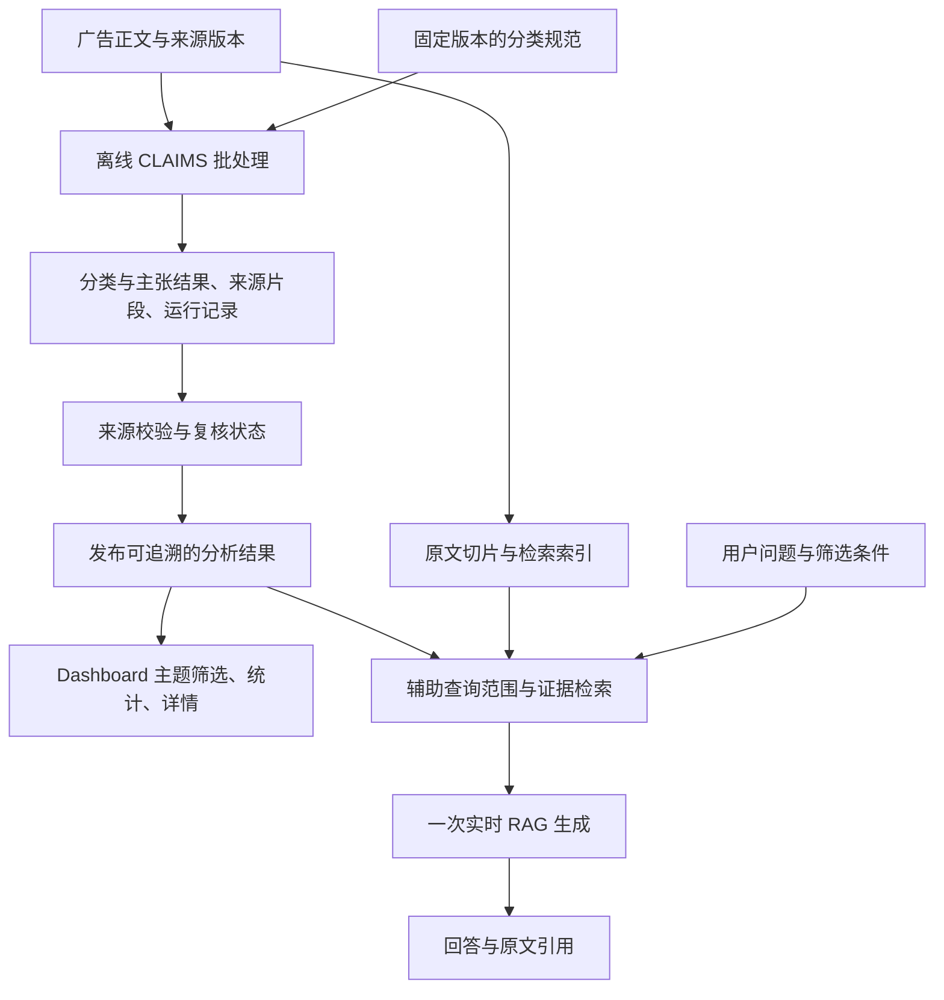

# CLAIMS 离线分析与实时 RAG 接入方案

日期：2026-09-25。状态：用户已确认“CLAIMS 离线批处理；网页可实时 RAG 问答”。本文记录接入目标和待完成工作；不表示 CLAIMS 2 已接通、重跑或发布。本轮只检查本地源码及离线文件，没有调用模型或远程分析接口。

## 已确认的分工

“离线”指文章分类与主张抽取在后台批量完成，不跟随用户每次提问运行；批处理仍可使用配置好的付费 API。“实时 RAG”指网页收到问题后检索已经发布的资料，再生成带原文引用的回答，不代表实时搜索公网。

原始广告是证据；CLAIMS 是对广告的派生分析；RAG 是对用户问题的回答。标签、子主张和上位主张可辅助检索，但不能替代原文，也不能把广告中的主张当成外部已核实事实。RAG 回答不自动回流为原始资料或分类金标准。

## 当前已经有的部分

- 当前导入器可读取 CLAIMS 1 的 `predictions_calibrated.csv`，只有 URL 唯一匹配且全文一致时才关联历史自动标签；这些标签供筛选与图表使用，状态仍是未经核实的历史自动结果。
- 网页已有实时混合检索、引用目录、一次生成和定位校验。接入 CLAIMS 不要求删除这一链路，也不应在其中增加逐次重新分类。
- 文章正文、稳定 record ID、正文版本、字符位置和历史引用已经保存，可以作为离线结果接入的基础。
- 当前尚没有 CLAIMS 2 离线结果的规范导入、分类批次发布和子主张／上位主张展示。这些是接下来要实现的内容。

## 接入分两步

### 第一步：先接已有离线结果

1. 固定一套 CLAIMS 分类规范和与之对应的输出，不混用不同目录中的 taxonomy 文件。
2. 将旧结果关联到当前文章。旧 `doc_id`／`source_article_id` 不直接视为当前 record ID；优先使用可靠 URL、正文版本及可定位原句，歧义单列。
3. 保存分类运行、类别、证据和审核状态；与原正文分开存放，不因接入标签改写原文。
4. 网页增加可追溯的 CLAIMS 结果展示与筛选。分类规范本身可以浏览，未经来源关联的结果不进入文章分类统计。
5. RAG 使用已关联结果辅助缩小或扩展候选，再回到原文检索和引用。普通正文搜索仍覆盖未标注的可检索文章，避免将“未分析”误当“不含该主张”。

### 第二步：补后台批处理

优先复用已有 CLAIMS 实现，独立于网页请求运行。处理新增正文或需要重新分析的文章，保存批次结果，经校验后发布。分类规范或模型改变时创建新运行；不静默覆盖旧批次。失败、未处理和待复核分别保留，不按阴性计算。

## 每条派生结果必须回答的问题

| 字段组 | 最少保存内容 | 用途 |
|---|---|---|
| 原文身份 | record ID、源正文版本、body hash、来源 URL | 防止错挂文章或把旧结果挂到新正文 |
| 分析身份 | 系统版本（CLAIMS 1／2）、run ID、分类规范版本、模型／提示标识、运行时间 | 区分不同规则和运行，不混算 |
| 分类结果 | 原始类别 ID；CLAIMS 2 的 NC／SC 关系及其规范版本 | 保留层级；不强行映射成旧十二标签 |
| 证据 | 原文片段、字符起止位置，必要时多个片段 | 从标签返回具体原文 |
| 状态 | 已处理／失败／待处理；来源关联状态；人工审核状态 | 区分工程可定位和语义已审核 |
| 来源回执 | 输入文件 hash、行号或 JSON 路径 | 回查原始离线输出 |

相似度不是正确概率；分类规范没有给出校准依据时，不展示“准确率／置信度百分比”。类别缺失不自动补 False，未映射上位类不自动猜测。

## 当前离线材料的实际缺口

本地 `D:/549/ml-ciss-native-ads-main/CLAIMS_2.0_model/src/dashboard/` 含一套候选文件：

- `greenwashing_codebook.json`：502 个子主张定义。
- `greenwashing_superclaims.json`：57 个上位主张定义。
- `claim_superclaim_map.json`：124 条子主张到上位主张映射，引用的类别均存在；另外 378 个子主张没有上位类映射。
- `greenwashing_claim_history.json`：502 个主张、756 条定义变更、seed 和 matched 等历史事件；不能把每一条历史事件当成一条已裁决的文章标注。

全量检查这些历史条目：740 条 `article_url="unknown"`、16 条 `N/A`，没有有效 HTTP URL；`metadata.article_id` 覆盖 42 个数字 ID。`source_article_id` 与 `metadata.article_id` 也不是同一编号。这些数字必须通过对应输入与原文确认，不能直接连接到当前数据库。现有目录内及其他目录的版本差异已在[历史源码审查](../reports/UPSTREAM_SOURCE_REVIEW_20260918.zh-CN.md)记录。

因此，首个接入产物应是“固定批次＋关联报告”：列出关联成功、歧义、原文不匹配、类别映射缺失和未处理数量。需要材料负责人指定正式分类规范／运行版本，并提供旧输入 ID 对应表；团队先准备候选和问题清单，不要求重新标注整个资料库。

## 接入验收

- **身份**：拒绝错文章、旧正文和无法定位的引文；同一输入重复导入不产生重复标注。
- **分类**：明确记录类别及映射版本；NC／SC 不存在或关系缺失时显式标记，不合成不存在的关系。
- **统计**：按文章／帖子去重；一篇的多句、多次历史事件不累计成多篇广告。报告已分析覆盖率，区分未处理和阴性。
- **网页**：显示类别定义、原文证据、运行版本与审核状态；筛选、详情和导出使用同一已发布批次。
- **RAG**：对比不使用 CLAIMS 和使用 CLAIMS 的检索效果，使用固定题目与原文 gold；同时检查新增遗漏，尤其是尚未标注的文章。
- **更新**：旧答案和引用仍可回查；切换分析批次有日志和回退路径，网页查询不触发分类或提案修改。
- **语义**：来源可定位与分类正确分开评分；历史模型结果不因为导入成功变成人工真值。

## 与原项目要求的关系

原 FA26 文档将完整 CLAIMS 后端集成留给后续学期，同时要求 RAG 检索与回答。用户本次决定提前接入离线 CLAIMS 分析，属于新增工程方向，不改写课程原文或冒充客户已批准的验收标准。

参考：[原文条款](../reports/fa26_requirements_source_20260916.md)、[现有导入契约](data_dictionary.md)、[现有评估协议](evaluation_protocol.md)。
