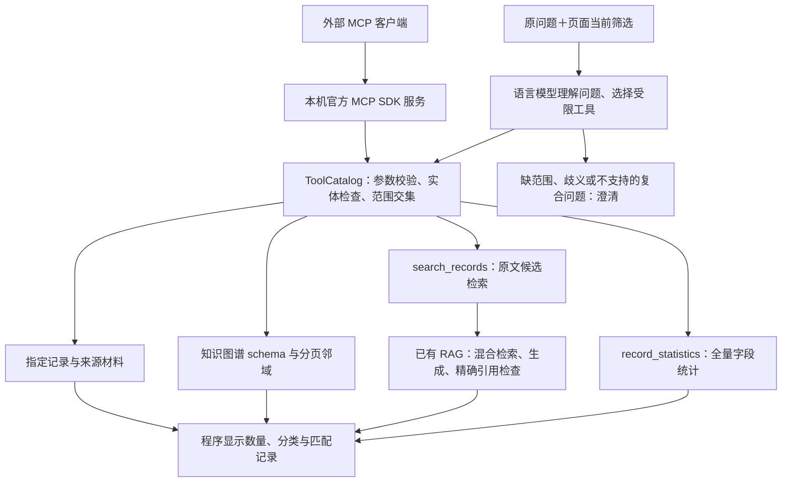

# 语言模型理解问题与 MCP 研究工具

更新日期：2026-09-29。本文说明本机实现与扩展接口；不代表已经部署到 Railway，也不代表完成客户语义验收。

## 1. 这次修正什么

截图中的 `Washington Post 有哪些赞助方?` 是媒体与赞助方名单问题。旧版只认识少量固定中英文句式；这个问法没有形成统计计划，进入了正文 RAG 路径。正文片段无法代替全库关系查询，增加另一个匹配句式也不能解决一般口语理解。

新路径先让语言模型理解问题、选择工具及参数，再由程序执行受限的数据库读取。模型不编写 SQL，不提供最后显示的计数，也不能扩大页面当前筛选范围。正文解释仍使用已有的检索与原文引用检查。

这里有两个需要区分的接口：

- **网页内部**使用 Responses function calling，把工具定义交给模型；执行器是 `ToolCatalog`。这是模型工具调用，不经过一个远程 MCP 服务器。
- **外部 MCP 客户端**使用真正的 MCP 协议发现并调用同一套工具。服务采用官方 Python SDK 2.x，默认通过本机 stdio 通信。

MCP 负责工具与上下文交换。自然语言理解、工具选择、预算及停止条件仍由应用中的 `ResearchAgent` 负责。这一区分符合 [MCP 官方架构说明](https://modelcontextprotocol.io/docs/learn/architecture)。

## 2. 实际流程



模型最多进行 4 个选择步骤、4 次工具调用，每轮只接受一个工具调用。实体解析和图谱 schema 可作为中间步骤；统计、正文检索、记录、来源和图谱邻域是结束步骤。复合问题如果不能由一个结束工具完整回答，应先澄清，不能只回答其中一半。

工具返回失败时停止；不会自动把失败的统计问题改送正文 RAG。模型直接写出的回答文本不作为统计或图谱结果发布。

## 3. 当前 7 个工具

| 工具 | 输入与用途 | 输出及边界 |
|---|---|---|
| `resolve_entity` | 名称、`sponsor` 或 `publisher`、可选筛选 | 根据实际源字段返回候选。一个候选可继续；多个或没有候选需澄清。显示别名不合并公司身份。 |
| `record_statistics` | 筛选；可按 `publishers`、`sponsors`、`platforms` 分组 | 每个已接入数据集的记录数、可检索数、未知日期数、完整分组计数及有限记录示例。计数来自 SQL，不是检索片段数。 |
| `search_records` | 查询、筛选、最多 10 条候选 | 关键词检索片段、命中诊断及来源引用。原生广告片段检查正文版本、哈希和精确字符区间；检索结果不是全库总数。 |
| `get_record` | 精确记录 ID、正文起点、最多 12,000 字符 | 不改写的正文区间、原文版本、哈希状态和字符位置。当前正文详情适配器支持原生广告。 |
| `get_record_sources` | 精确记录 ID、筛选 | 原始网址、归档引用、来源关系、历史标注与限制。当前 MCP 材料适配器还未连接核验 PDF 附件，不冒充附件已经可用。 |
| `get_graph_schema` | 无业务参数 | 节点类型、关系定义、实体身份规则和已接入／未接入的适配器。 |
| `get_graph_neighborhood` | 筛选、可选记录 ID、分页，最多 5 篇 | 文章中心的类型化来源图谱。不是完整全库图谱，不能用邻域节点数回答全库数量。当前支持原生广告。 |

网页模型另有 `request_clarification` 控制工具，用于提出一句澄清问题；它不是 MCP 服务器暴露的数据读取工具。

契约入口：[`research_tools.py`](../src/observatory/research_tools.py)。网页调用和 MCP 调用复用同一个执行器；前者提供严格的 Responses schema，后者提供 MCP `inputSchema`。

## 4. 范围、计数和来源契约

### 不能让模型扩大范围

每次网页请求创建独立 `ToolCatalog`，复制可信页面筛选。工具可增加媒体、赞助方、日期或记录条件，只能与当前条件取交集。请求 `all` 不能把当前单一数据集扩大为两个数据集；空列表不能清除现有筛选。名称必须属于实际数据字段；未知名称返回澄清。

直接 MCP 会话的初始范围由启动参数确定。例如以 `--publisher "The Washington Post"` 启动，后续工具不能跳出该媒体。这是范围约束；本机模式尚未新增面向多用户的远程身份与授权系统。

### 计数单位明确

- 原生广告计数单位是符合当前准入规则的存储文章记录。
- 社交广告计数单位是符合当前准入规则的社交记录；两个单位分开显示。
- 没有可检索正文的记录也可参与字段统计。
- 未接入的数据集应显示未接入，不能把缺数据解释为“广告数为零”。
- Sponsor 包含公司、协会、会议等来源类别。结果表示源字段记录的联系，不自动证明合同、支付、法人身份或真实世界的全部合作。
- 工具参数指定日期时排除未知日期记录，避免把缺日期记录计入一个已知日期区间。没有新日期参数时保留页面可信范围的未知日期开关；显示有效范围和未知日期数。

每个数据集的统计和例示记录复用已有的只读数据库快照。不同工具调用或两个数据集的读取不能宣称共享同一个快照；记录的 `version_id` 才是该条来源的具体版本依据。网页还检查请求过程中数据版本是否变化，变化时要求重试。

### 原文证据的定位

正文和检索工具保留 `record_id`、`version_id`、`body_hash`、`start`、`end`。位置是 **Python Unicode 字符区间**，不是 PDF 页码或图片坐标。哈希和字符匹配证明文字位置；不证明语义支持或广告主张真实。

来源工具只读当前库中的公开字段，不任意抓网页、读用户指定文件路径或接受模型提供的 URL。缺失归档、附件适配器或正文必须保留缺失状态。

## 5. 知识图谱与 CLAIMS 的扩展空间

当前 schema 为 `advertising-source-graph-v1`，主要节点包括文章、文本版本、候选赞助方、媒体、来源材料、标注、标签和证据区间。关系具有类型与出处，例如 `source_lists_sponsor`、`published_in`、`has_text_version`、`has_annotation_record`、`has_evidence`。

`get_graph_schema` 让调用方先了解关系含义；`get_graph_neighborhood` 返回邻域和来源元数据。这个接口可以继续接更完整的图谱存储或来源适配器，而不用让模型直接接数据库查询语言。

新增能力应满足以下条件后接入：

| 后续能力 | 接入前必须准备什么 |
|---|---|
| 更完整的公司、协会和媒体身份 | 经过确认的名称、别名、类型与归并规则；保留原字段和审核版本。 |
| 核验 PDF／截图材料 | 当前记录版本、正文或采集身份与附件哈希的明确绑定；不能只按相似标题关联。网页已有的核验附件不代表 MCP 适配器已经接入。 |
| 新 CLAIMS 主张与标签 | 正式 codebook、分类版本、正文哈希、证据区间、说话人／文章处理方式及人工或模型状态。 |
| 外部事实核查 | 独立证据、时间、来源身份与核查结果；与“文章中出现某种说法”分开。 |
| 社交记录的图谱及材料 | 正式导出和字段含义，以及与社交记录版本绑定的正文／素材详情适配器。 |

现有历史 CLAIMS 标签是历史自动标注；部分缺正式 codebook 或与当前正文绑定的证据。因此不能直接回答“哪些广告已被验证为漂绿”。可以展示来源中保存了什么标签，或检索出现什么说法，但必须保留这个区别。详见[来源知识图谱说明](KNOWLEDGE_GRAPH_V1.zh-CN.md)。

## 6. 使用与费用

### 网页模型路径

`OBS_RESEARCH_AGENT_ENABLED=true` 启用新的语言模型工具选择路径；为旧版工程对照保留关闭开关。默认配置对象保持兼容，部署时需要明确设置开关，不应依靠本机环境推断线上已启用。

**Generate answer 现在可能先产生问题理解费用，即使最后只是数据库计数。** SQL、图谱和来源工具本身不调用模型；正文回答还会产生原有检索嵌入和生成费用。网页须显示这一区别，不能继续把所有自然语言数量问题描述为免费。

每轮模型调用沿用项目的预算、速率和并发限制。发出请求但费用结果未知时保留费用预留；不能因网络错误就假定没有花费。数据库浏览、图表与关键词搜索继续可以独立使用。

### MCP 本机入口

从项目根目录，在已有运行环境中安装可选的官方 SDK 依赖：

```powershell
uv sync --extra test --extra pdf --extra mcp
```

本机 stdio 服务：

```powershell
.\.venv\Scripts\python.exe -m observatory.mcp_server --dataset native
```

它等待 MCP 客户端协议请求；不是交互式问答终端，也不会主动调用语言模型。标准输出用于 MCP 消息。

只允许某个媒体的例子：

```powershell
.\.venv\Scripts\python.exe -m observatory.mcp_server --dataset native --publisher "The Washington Post"
```

外部 MCP 客户端的 stdio 配置可使用如下通用形式；具体导入位置由客户端决定，本轮未替用户修改外部客户端配置：

```json
{
  "mcpServers": {
    "advertising-observatory": {
      "command": "D:\\Projects\\549 native ads\\.venv\\Scripts\\python.exe",
      "args": ["-m", "observatory.mcp_server", "--dataset", "native"]
    }
  }
}
```

服务使用现有服务端配置。不要把数据库连接串或 API 密钥填进可公开的示例、日志、工具结果或提交文件。另可启动独立的本机 HTTP 传输：

```powershell
.\.venv\Scripts\python.exe -m observatory.mcp_server --transport streamable-http --host 127.0.0.1 --port 8051
```

HTTP 只允许回环地址，端口独立于网页。它未挂载到公共 Railway 网站；公共远程 MCP 的身份、授权和部署另需设计与验收。[官方 SDK 仓库](https://github.com/modelcontextprotocol/python-sdk)与 [PyPI 包](https://pypi.org/project/mcp/)提供所用协议实现，本项目没有重新实现 MCP。

## 7. 如何检验，而不是继续只补固定问法

工程回归应覆盖范围交集、未知实体、无数据集、未知日期、来源版本、哈希／偏移、越界正文、额外参数、工具调用上限、预算不足、费用未知和模型只写文本的情况。

语言理解还需单独评价。以下是开发／边界题示例，不是独立验收结果：

| 题目 | 应检查的行为 |
|---|---|
| `Washington Post 有哪些赞助方?` | 媒体解析后读取全部来源赞助方及数量。 |
| `WaPo里是哪些企业在买广告?` | 别名对应实际媒体；解释来源类别并非全部是已确认企业或支付关系。 |
| `Shell在哪几家媒体出现过，2020到2022?` | 解析实体及日期，保留当前筛选，不把未知日期算入该区间。 |
| `纽约时报有多少广告，主要怎么说碳捕集?` | 不能只输出数量然后忽略正文问题；当前单结束工具模式应澄清任务。 |
| `这些里面去年谁最多?` | 没有明确指代／参考日期时澄清，不补造历史。 |
| `What percentage are greenwashing?` | 需要定义分母与正式判断标签；不把主题词检索当作漂绿判定。 |
| 当前只选 NYT，却问 Washington Post | 返回范围冲突／澄清，不跳出筛选。 |
| 请求 `Exxon and Mobil` 的总数 | 不自行把公司身份或多个源类别归并。 |

离线工具调用回放能证明程序按既定调用正确执行，不能证明真实模型理解所有自然语言。有限真实调用只能报告实际题目、结果、调用数、费用和延迟；客户未见题目与人工语义审查仍需另做。

## 8. 尚未完成

- 跨轮对话指代与记忆：目前每次请求是独立范围；“刚才那些”“上次那个”不能凭空补全。
- 一个请求内同时完成多个最终研究任务：当前采取澄清，尚未实现多结果计划与汇总。
- 经审核的公司身份归并、法人关系与完整企业图谱。
- MCP 的核验附件、社交详情和外部事实核查适配器。
- 正式 CLAIMS 证据标注集，以及新问题上的客户语义验收。
- 公共远程 MCP 部署和外部客户端配置。本机 stdio 入口与网页中的模型工具路径可先独立使用。

## 代码入口

| 部分 | 文件 |
|---|---|
| 模型理解、选择、预算和有限循环 | [`research_agent.py`](../src/observatory/research_agent.py) |
| 工具 schema、范围与数据读取 | [`research_tools.py`](../src/observatory/research_tools.py) |
| 官方 MCP SDK 服务 | [`mcp_server.py`](../src/observatory/mcp_server.py) |
| 网页路由与统计／正文回答的连接 | [`service.py`](../src/observatory/service.py) |
| 原文检索、生成与引文校验 | [`rag.py`](../src/observatory/rag.py) |
| 类型化来源图谱 | [`knowledge_graph.py`](../src/observatory/knowledge_graph.py) |
