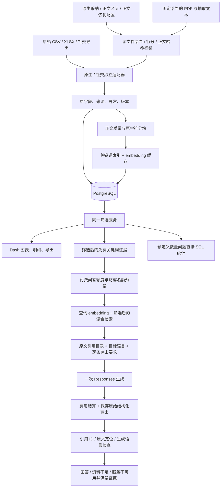

# 架构与数据流 — 0.2.3

## 实际实现边界

采用一个 Python 包、一个 PostgreSQL 数据库和本机批处理命令。Dash/Waitress 提供公众页面，管理任务通过 CLI 执行。社交数据采用同一记录契约和独立导入映射，等待真实导出；历史 CLAIMS 仅导入静态结果。

## 原生数据采纳与正文范围

正式 `import-native` 强制要求三份配置：[采纳](../config/native_admissions.json)、[原 CSV 正文区间](../config/native_body_ranges.json)和[正文恢复](../config/native_body_recoveries.json)。配置固定源文件相对路径、SHA-256、精确 URL、含表头逻辑行号及原正文 UTF-8 哈希；后两者另固定 record ID。恢复配置还固定 PDF／抽取文本哈希、页码区间和保留范围。每份配置先逐项验证再应用，自身哈希进入导入来源；缺失或失效时在数据库发布前停止，避免静默停用已纳入记录或退回旧正文。引用说明不等于程序已在线确认来源。

当前12条新增候选已作 **7纳入／4排除／1待核** 的 AI 工程决定，保留全部候选审计记录。7条中5条使用正文、2条仅元数据。项目继续覆盖已有 CERAWeek 行业活动付费内容；add-04 的规范赞助方保持 unknown，add-07/11 的日期保持 unknown，原始冲突值保留。新增 sponsor 使用 `casefold()`，精确媒体简称 `WSJ` 规范为 `The Wall Street Journal`；原始拼写留在 `raw.supplement`。所有 keyword 保留源数据字面值及大小写；不从关键词推断赞助方，也不自动合并公司别名。身份采纳、字段未知和正文资格各自限制相关功能，AI 采纳不代表人工批准。

正文原字符串始终保留。显式 `retrieval_ranges` 是当前正文版本内有序、非空、不重叠的字符半开区间，优先于旧 `retrieval_end` 前缀；没有显式区间时才回退到前缀或全部存储文本。20处导航审核排除具体链接并保留有效后文；每个区间独立分块，段落 ID 来自该版本完整存储文本，块与引用不跨排除间隙拼接。区间修复不能开启明确 `metadata_only` 的记录。配置和审阅依据见[数据字典](data_dictionary.md)。

0.2.3 在原 CSV 区间审核之后，为 PDF-265 采用新的7,098字符抽取文本，只检索6个区间、合计4,767字符。其本地采集清单与正文身份已交叉核对，线上 canonical 尚未确认；页边遮挡、不可见链接文字和未转录信息图使其仍是 `partial`。不拼跨页半句，不使用缺失图像数字。原 CSV 的94项疑似截断仍是来源限制，其中这一篇得到有限续文，不能称已恢复全文。抽取文件随私有资料提供，或用可选 `pypdf==6.10.0` 和[提取脚本](../scripts/extract_pdf_text.py)复现；应用运行和导入不依赖 PDF 提取器。详见[恢复报告](../reports/pdf265_body_recovery.md)。

## 数据版本

- `records` 保存稳定身份、数据集与当前版本指针。
- `record_versions` 保存全部原字段、来源位置、正文、异常、披露文字和采纳／正文区间审计。版本是规范 JSON 的 SHA-256。
- `chunks` 保存文章版本、原文起止 Unicode 字符位置及段落 ID。旧正文不被覆盖，历史引文可回查。
- `annotations` 保存具有当前正文依据的历史 CLAIMS 标签，公众默认读取明确标记的调整版本。PDF-265 的新版本清空当前标签，将旧标签保留在内部 `raw.previous_body_annotations`；旧版本仍可访问，不能将旧标签当成新增文字的标注。
- `embeddings` 按片段文本 SHA-256＋模型缓存，维度 1536；多个版本的相同正文块复用向量。
- `imports`、`usage_ledger`、`generation_outputs`、`answer_runs` 保存导入、付费用量、原始结构化模型输出与最终问答审计记录。

导入在单个事务内发布全部当前指针；重复输入不增添版本。元数据变化也产生新版本，旧正文片段仍保留。向量未生成时关键词检索可以使用。

当前数据沿用0.2.3发布的版本 `5114ebc1cf9afe59cdaa715e3ea45166` 有 **275条收录、263条可计数、226条可检索和558个当前片段**。本次只新增 PDF-265 的一个 `record_version`，其余274条不变，重复导入275条均不变；该篇元数据、其他记录和计数资格不变。发布校验确认558个当前片段定位、86个历史引文定位及15个开发 gold 原句有效，见[发布验证](../outputs/pdf265_publication_validation_20260916.json)。完整测试209项通过（19.63秒），这些工程检查不等于人工语义验收。

此前0.2.2的 `d85a98002e4493f0376c260ad82253ee`／554片段，以及更早的268／256／221／510快照，均按原版本保留；旧输出不改写。0.2.2付费开发结果也不自动成为新数据版本的成绩，详见[历史证据](data_dictionary.md)。

付费开发运行 `532453a7c43740ecbe5f4954d3522f41` 使用的是先前版本 `c5ad20ac2938e619e11fe1f8bfc26b97`。该次有3道英语题产生西班牙语／法语回答，作为诊断保留；不能称为当前语义质量通过。

## 检索与回答

结构化过滤条件进入参数化 SQL，先限定当前版本和数据集，再分别做 PostgreSQL 英文全文搜索与 pgvector 精确余弦检索。两路各取前50片段，使用倒数排名融合结果；先选前5篇不同文章，再在这些文章中各取最多3个相关片段，并按文章内原文顺序提供给模型。免费关键词检索仍为每篇1片段。文章命中与关键段落覆盖分别评测；该流程不宣称读取了全文。

免费 Search 只使用关键词；Paid answer 使用缓存的查询 embedding、混合检索及 Responses。检索返回原文片段；问题明确包含完整文章标题时，在已有筛选范围内限定到这些文章。

引用目录复用 [pySBD](https://github.com/nipunsadvilkar/pySBD) 的英文句界检测，设置 `clean=False, char_span=True`。0.2.4 先按空段和分页划分独立区域，再为分句构造等长视图：每个段内空白字符单独换成空格，CRLF 保留两个位置。分句坐标经范围、顺序、视图相等和非空文字覆盖校验后，用相同坐标切原文。存储正文和引文换行不变，句子合并不跨上述边界。相邻完整句可合并为不超过60词的引用单元；超长句才采用60词、15词重叠的窗口。此60词上限是本工程的展示选择，原项目文档未规定。它用于用户提供的原始语料；未来导入不同授权来源时应独立配置引用政策。

模型为每项陈述选择实际存在的目录编号；Structured Outputs 的枚举约束限定编号，程序回填原文引句，避免抄写错误。输入以来源元数据和有序原文引用单元组织，不再重复输入同一段全文与目录。最终校验记录、版本及字符位置。句界库遇到异常偏移会在模型调用前失败并释放未发送的预留额度。当前558个片段的原文区间定位已检查；先前554或510片段的检查属于旧快照。这些检查只能保证引文存在，不能保证它足以支持生成陈述；语义支持仍需单独评价。

2026-09-16 后续修订将结构化输出字段顺序设为先 `passage_id`、后 `text`，并要求仅写回答问题所需、被所选片段支持的内容；原文已有全称时展开单位，保留数量和时间基准。它是可检验的提示与输出顺序调整，不保证模型必然遵循。后续生成调用的 usage 审计保存提示和动态 schema 的 SHA-256 及供应商返回的模型名；评测运行在开始时保存提示及模块文本哈希，早期记录不回填为新实现结果。此做法参考 [OpenAI 提示工程文档](https://developers.openai.com/api/docs/guides/prompt-engineering) 的代码版本化与代表性评测建议。

检索集合不用于推算总体数量。只接受预定义的当前筛选数量问题，调用统计服务；其他数量问题引导用户使用筛选和计数。

0.2.1 接入本地 Lingua 2.2.0，以提问语言生成明确的 system 约束，仅检查模型写出的每条及合并说明，不检测原始引文。短文本、低差值或目标不明保留 inconclusive；明确错语返回 service_unavailable，原输出、费用和过滤证据保留，不自动再调用模型。该检查是启发式，见[语言修复报告](../reports/language_guard_v0_2_1.md)。

0.2.2 在 Pydantic `text` 字段描述和 system 中加入逐条自足的来源归因、测量对象、完整单位、时间基准及计划状态要求。输出接口仍为 passage_id + text，没有新增一个可冒充语义验证的模型自报字段。通过 schema 或语言检查不证明这些含义正确，仍按原 rubric 审阅；见[本轮诊断](../reports/claim_contract_v0_2_2.md)。

正文与问题都作为不可信资料。生成调用不配置工具、浏览器、代码执行或数据库执行能力。模型拒答、失败、编造 ID 或引文不匹配时不发布为正常回答。

## 付费边界

预算预留存于 PostgreSQL，并使用事务级 advisory lock 避免并发超额。问答在查询 embedding 之前取得访客限流和生成名额；embedding 批次独立记账。SDK 自动重试关闭，避免无法归属的额外调用。超时等不确定结果保留最坏预留额，不能直接当作免费调用。

模型/价格依据（核对 2026-09-16）：[Luna 模型](https://developers.openai.com/api/docs/models/gpt-5.6-luna)、[Structured Outputs](https://developers.openai.com/api/docs/guides/structured-outputs)、[标准价格](https://developers.openai.com/api/docs/pricing)。短上下文 Luna 输入/输出为每百万 token $0.20/$1.20，缓存读取/写入为 $0.02/$0.25；embedding 为 $0.02/百万输入 token。应用不使用长上下文、批量价格或额外付费工具。实际付费接入与开发题已运行，结果见 `reports/evaluation.md`；这不等于语义验收通过。

0.2.4 当前生成诊断见[引文上下文报告](../reports/quote_context_v0_2_4.md)。558 个当前块的 4,672 个候选引文通过原文匹配和覆盖检查；新提示区分报道来源和行动主体，但真实 smoke 仍有主体归因错误。不能把候选目录质量解释为模型语义质量。
