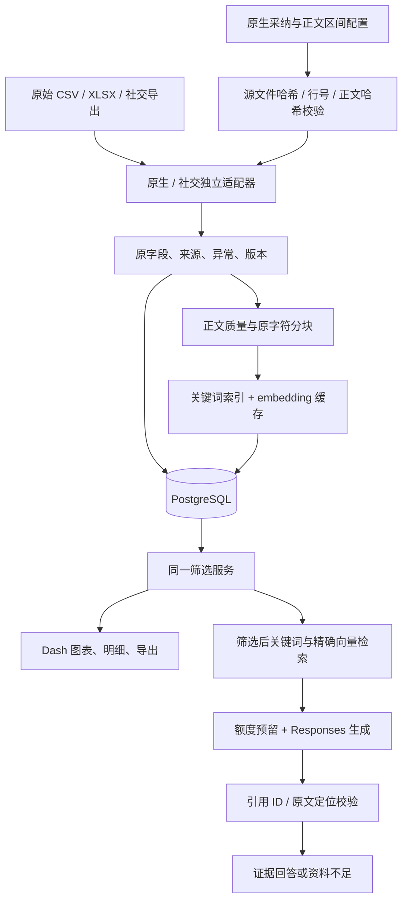

# 架构与数据流 — 0.2.0

## 实际实现边界

采用一个 Python 包、一个 PostgreSQL 数据库和本机批处理命令。Dash/Waitress 提供公众页面，管理任务通过 CLI 执行。社交数据采用同一记录契约和独立导入映射，等待真实导出；历史 CLAIMS 仅导入静态结果。

## 原生数据采纳与正文范围

`config/native_admissions.json` 与 `config/native_body_ranges.json` 分别固定合并 CSV 和基准 CSV 的相对路径、源文件 SHA-256、精确 URL、含表头逻辑行号、原始正文 UTF-8 哈希；正文区间配置另固定 record ID。两份配置都逐项校验后才应用，配置自身哈希进入导入来源。源文件、行号、正文或身份变化必须重新审核，不能继续套用旧规则。`import-native` 强制要求两份配置，缺失或失效时在数据库发布前停止；不能静默退回旧基准并停用已纳入的7条。

当前12条新增候选已作 **7纳入／4排除／1待核** 的 AI 工程决定，保留全部候选审计记录。7条中5条使用正文、2条仅元数据。项目继续覆盖已有 CERAWeek 行业活动付费内容；add-04 的规范赞助方保持 unknown，add-07/11 的日期保持 unknown，原始冲突值保留。新增 sponsor 使用 `casefold()`，精确媒体简称 `WSJ` 规范为 `The Wall Street Journal`；原始拼写留在 `raw.supplement`。所有 keyword 保留源数据字面值及大小写；不从关键词推断赞助方，也不自动合并公司别名。身份采纳、字段未知和正文资格各自限制相关功能，AI 采纳不代表人工批准。

正文原字符串始终保留。显式 `retrieval_ranges` 是有序、非空、不重叠的原文半开区间，优先于旧 `retrieval_end` 前缀；没有显式区间时才回退到前缀或全文。20处已审核的导航边界通过这些区间排除具体链接并保留有效后文，94处疑似截断仍未恢复。每个区间独立分块并转回原文字符位置，段落 ID 来自原始完整正文；块与引用不跨被删间隙拼接。区间修复重新检查选中正文质量，但不能开启明确 `metadata_only` 的记录。配置和审阅依据见[数据字典](data_dictionary.md)。

## 数据版本

- `records` 保存稳定身份、数据集与当前版本指针。
- `record_versions` 保存全部原字段、来源位置、正文、异常、披露文字和采纳／正文区间审计。版本是规范 JSON 的 SHA-256。
- `chunks` 保存文章版本、原文起止 Unicode 字符位置及段落 ID。旧正文不被覆盖，历史引文可回查。
- `annotations` 保存原始和调整后的历史 CLAIMS 标签，公众默认读取明确标记的调整版本。
- `embeddings` 按片段文本 SHA-256＋模型缓存，维度 1536；多个版本的相同正文块复用向量。
- `imports`、`usage_ledger`、`answer_runs` 保存导入、付费用量与问答审计记录。

导入在单个事务内发布全部当前指针；重复输入不增添版本。元数据变化也产生新版本，旧正文片段仍保留。向量未生成时关键词检索可以使用。

当前本地数据版本 `d85a98002e4493f0376c260ad82253ee` 有275条收录、263条可计数、226条可检索及554个当前片段，媒体分组仍为8个。0.2.0首次导入因记录结构新增字段产生275个新版本，第二次275条均未变；中间 sponsor/keyword 大小写修订产生7个新版本，媒体简称对齐产生2个新版本。最终发布恢复 keyword 源拼写，产生7个新版本、268条未变；重复导入又为275条未变。最终只保留 sponsor 大小写和明确媒体简称规范。这些运行没有停用记录，旧版本全部保留。它们验证版本与重复导入行为，不能证明原文或回答正确。旧268／256／221／510等快照继续按原版本保存；详见[数据字典中的导入证据](data_dictionary.md)。

付费开发运行 `532453a7c43740ecbe5f4954d3522f41` 使用的是先前版本 `c5ad20ac2938e619e11fe1f8bfc26b97`。该次有3道英语题产生西班牙语／法语回答，作为诊断保留；不能称为当前语义质量通过。

## 检索与回答

结构化过滤条件进入参数化 SQL，先限定当前版本和数据集，再分别做 PostgreSQL 英文全文搜索与 pgvector 精确余弦检索。两路各取前50片段，使用倒数排名融合结果；先选前5篇不同文章，再在这些文章中各取最多3个相关片段，并按文章内原文顺序提供给模型。免费关键词检索仍为每篇1片段。文章命中与关键段落覆盖分别评测；该流程不宣称读取了全文。

免费 Search 只使用关键词；Paid answer 使用缓存的查询 embedding、混合检索及 Responses。检索返回原文片段；问题明确包含完整文章标题时，在已有筛选范围内限定到这些文章。

引用目录复用 [pySBD](https://github.com/nipunsadvilkar/pySBD) 的英文句界检测，设置 `clean=False, char_span=True`，逐一检查其字符位置、原文相等和非空文字覆盖。相邻完整句可合并为不超过60词的引用单元；超长句才采用60词、15词重叠的窗口。此60词上限是本工程的展示选择，原项目文档未规定。它用于用户提供的原始语料；未来导入不同授权来源时应独立配置引用政策。

模型为每项陈述选择实际存在的目录编号；Structured Outputs 的枚举约束限定编号，程序回填原文引句，避免抄写错误。输入以来源元数据和有序原文引用单元组织，不再重复输入同一段全文与目录。最终校验记录、版本及字符位置。句界库遇到异常偏移会在模型调用前失败并释放未发送的预留额度。当前554个片段的原文区间定位已检查；先前510片段的句界检查属于旧快照，不改写为本轮结果。这些检查只能保证引文存在，不能保证它足以支持生成陈述；语义支持仍需单独评价。

2026-09-16 后续修订将结构化输出字段顺序设为先 `passage_id`、后 `text`，并要求仅写回答问题所需、被所选片段支持的内容；原文已有全称时展开单位，保留数量和时间基准。它是可检验的提示与输出顺序调整，不保证模型必然遵循。后续生成调用的 usage 审计保存提示和动态 schema 的 SHA-256 及供应商返回的模型名；评测运行在开始时保存提示及模块文本哈希，早期记录不回填为新实现结果。此做法参考 [OpenAI 提示工程文档](https://developers.openai.com/api/docs/guides/prompt-engineering) 的代码版本化与代表性评测建议。

检索集合不用于推算总体数量。只接受预定义的当前筛选数量问题，调用统计服务；其他数量问题引导用户使用筛选和计数。

正文与问题都作为不可信资料。生成调用不配置工具、浏览器、代码执行或数据库执行能力。模型拒答、失败、编造 ID 或引文不匹配时不发布为正常回答。

## 付费边界

预算预留存于 PostgreSQL，并使用事务级 advisory lock 避免并发超额。问答在查询 embedding 之前取得访客限流和生成名额；embedding 批次独立记账。SDK 自动重试关闭，避免无法归属的额外调用。超时等不确定结果保留最坏预留额，不能直接当作免费调用。

模型/价格依据（核对 2026-09-16）：[Luna 模型](https://developers.openai.com/api/docs/models/gpt-5.6-luna)、[Structured Outputs](https://developers.openai.com/api/docs/guides/structured-outputs)、[标准价格](https://developers.openai.com/api/docs/pricing)。短上下文 Luna 输入/输出为每百万 token $0.20/$1.20，缓存读取/写入为 $0.02/$0.25；embedding 为 $0.02/百万输入 token。应用不使用长上下文、批量价格或额外付费工具。实际付费接入与开发题已运行，结果见 `reports/evaluation.md`；这不等于语义验收通过。
