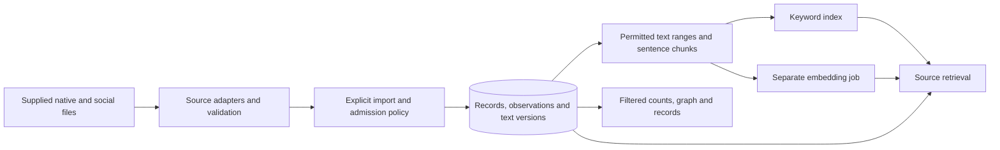
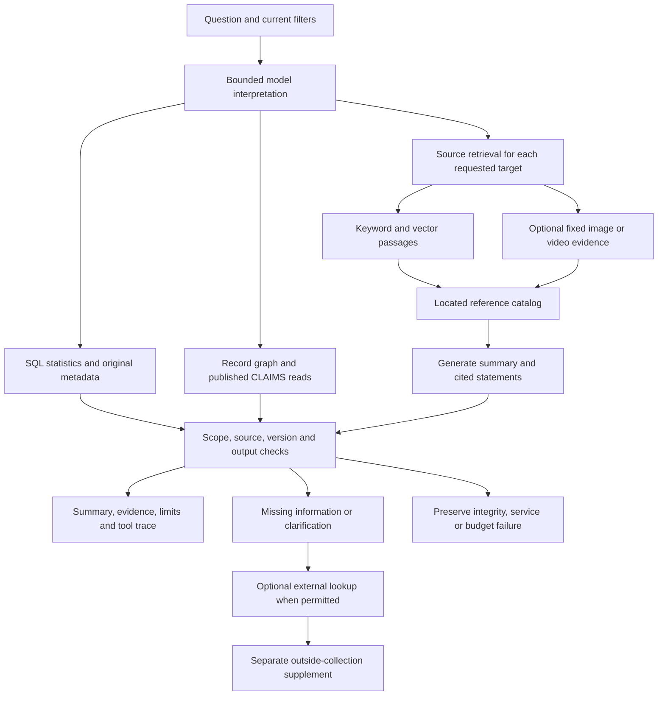
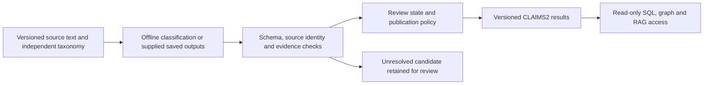

# System design and data flow

Checked against local source on 8 October 2026. This page describes the implementation, not a deployment, semantic accuracy result or client acceptance. For dated progress and remaining work, use [goal.md](../goal.md), [plan.md](../plan.md) and [work.md](../work.md). The [earlier 0.2.3 design](architecture_0_2_3.md) retains its historical scope.

The required outcome is to explore native and social advertising and answer questions grounded in their records. Requirements and their sources remain in [client goals](../client_goal.md); implementation requests remain in [user goals](../user_goal.md). A collected company post is not automatically a verified paid advertisement.

## Modules and responsibilities

| Module | Input → output | Implementation |
| --- | --- | --- |
| Source preparation and import | Supplied files and admission decisions → validated records, source observations and text versions | [ingest.py](../src/observatory/ingest.py), [social_archive.py](../src/observatory/social_archive.py), [social_admission.py](../src/observatory/social_admission.py) |
| Storage and indexing | Versioned text and permitted ranges → SQL fields, sentence chunks, keyword index and embeddings | PostgreSQL, pgvector; [db.py](../src/observatory/db.py), [chunking.py](../src/observatory/chunking.py), [indexing.py](../src/observatory/indexing.py) |
| Data exploration | Current filters and selected entities → counts, charts, typed relationships, records and CSV | Dash, Plotly, AG Grid, Cytoscape; [app.py](../src/observatory/app.py), [knowledge_graph.py](../src/observatory/knowledge_graph.py) |
| Research tools | Question interpretation and trusted filters → bounded statistics, record, source or classification reads | [research_tools.py](../src/observatory/research_tools.py), [research_agent.py](../src/observatory/research_agent.py), optional [MCP transport](../src/observatory/mcp_server.py) |
| Answer generation | Retrieved source passages and optional fixed media evidence → summary, cited statements and limitations | OpenAI Responses API; [service.py](../src/observatory/service.py), [rag.py](../src/observatory/rag.py), [media_reader.py](../src/observatory/media_reader.py) |
| Offline classification | Versioned source text, taxonomy and saved or new model results → validated assignments with review state | [CLAIMS2 import](claims_result_import.md), [read-only views](claims_read_views.md), [semantic review](../src/observatory/semantic_review.py) |
| Evaluation and handoff | Frozen code, data, questions and references → scoped checks, review records and reports | [test gate](test_gate.zh-CN.md), [evaluation methodology](evaluation_methodology.md), [current handoff](current_handoff.md) |

Pydantic and Pandera validate inputs; pySBD and tiktoken support text boundaries. Waitress serves the Python application. Docker/Railway host the application; GitHub Pages hosts only the static introduction. Dependencies are declared in [pyproject.toml](../pyproject.toml) and resolved in [uv.lock](../uv.lock). The source graph is derived from stored records and assignments; it does not require a separate graph database.

## 1. Data preparation

```mermaid
flowchart LR
    F[Supplied native and social files] --> A[Source adapters and validation]
    A --> I[Explicit import and admission policy]
    I --> D[(Records, observations and text versions)]
    D --> T[Permitted text ranges and sentence chunks]
    T --> K[Keyword index]
    T --> E[Separate embedding job]
    D --> C[Filtered counts, graph and records]
    K --> R[Source retrieval]
    E --> R
    D --> R
```

- Original files, row identities, hashes and earlier versions remain available. An accepted text replacement creates a new version; old classifications are not silently inherited.
- Social post identity and saved source observations are separate. Conflicting observations remain separately attributable, rather than being joined into an invented body. See [source-observation retrieval](all_social_posts_retrieval.zh-CN.md).
- `countable` controls the statistical denominator; `retrievable` and permitted ranges control text access. Text completeness, vector coverage, media availability and classification coverage are separate properties.
- Imports do not call a model. Embedding preparation and execution are separate operations; importing text does not establish that vectors exist.
- Counts, chart selections, record pages and CSV use the same filters. A displayed page or bounded graph neighborhood is not the complete selection.

Use the [data dictionary](data_dictionary.md) for field meanings and the [import contract](PROTOTYPE_DATA_PIPELINE.md) for commands and update semantics. Current counts and completed runs belong in dated status records, not in this architecture diagram.

## 2. Online questions

```mermaid
flowchart TD
    Q[Question and current filters] --> P[Bounded model interpretation]
    P --> S[SQL statistics and original metadata]
    P --> G[Record graph and published CLAIMS reads]
    P --> R[Source retrieval for each requested target]
    R --> H[Keyword and vector passages]
    R --> M[Optional fixed image or video evidence]
    H --> C[Located reference catalog]
    M --> C
    C --> L[Generate summary and cited statements]
    S --> V[Scope, source, version and output checks]
    G --> V
    L --> V
    V --> A[Summary, evidence, limits and tool trace]
    V --> U[Missing information or clarification]
    U --> W[Optional external lookup when permitted]
    W --> X[Separate outside-collection supplement]
    V --> F[Preserve integrity, service or budget failure]
```

The web application uses function calling against a shared tool catalog. A separate MCP process exposes the same data operations to external clients; the dashboard is not a remote MCP endpoint. The supported tools, fields and limits are listed once in [MCP and research tools](mcp_research_tools.md). A configured legacy answer path remains available.

**Statistics use the complete filtered database selection.** The model chooses operations and interprets the question; SQL calculates counts, date comparisons and shares. Source-field relationships do not independently establish payment, ownership or contracts. Native advertisements and company posts retain separate counting units.

**Content answers use retrieved evidence.** Keyword and vector candidates are combined, with separate retrieval for comparison targets. Overlapping source intervals are merged before creating short reference units. The model selects reference IDs; the program restores quotation text and checks source version, body hash, permitted range and character positions. These checks establish traceability, not semantic correctness or factual truth. Retrieved candidates cannot establish a complete list of all advertisements containing a claim.

**Media is a separate evidence route.** The service may read a fixed operator-supplied bundle, retrieve image and video derived text separately, and join it with body references. The web page distinguishes body quotes, image descriptions and caption/transcript excerpts with their available locations. This read does not run OCR, transcription, downloads or classification. Engineering support is separate from real material preparation and activation; see [media evidence](media_answers.md).

**Missing information remains visible.** Clarification and ordinary evidence gaps may receive one external supplement when configuration and budget allow. Exact zero counts, source-integrity failures, changed data, service failures and budget limits are not repaired by inventing outside results. External findings retain their own sources and never become collection counts or stored source fields automatically. The MCP empty-search ticket has a narrower trigger than the web fallback.

The answer layout is **Summary → Evidence → Scope and limitations**, followed by the tool/cost trace. Loading messages report actual stages. Calls reserve budget before execution; uncertain charges remain recorded. Dates preserve the selected source or supplemented basis. Detailed behavior is in the tool guide and [shared prompts](../src/observatory/prompts.py).

## 3. Offline classification and review

```mermaid
flowchart LR
    D[Versioned source text and independent taxonomy] --> C[Offline classification or supplied saved outputs]
    C --> V[Schema, source identity and evidence checks]
    V --> R[Review state and publication policy]
    R --> I[Versioned CLAIMS2 results]
    I --> Q[Read-only SQL, graph and RAG access]
    V --> H[Unresolved candidate retained for review]
```

CLAIMS runs offline. Online questions read published assignments instead of rerunning classification. Source-independent taxonomies and upstream saved outputs may be reused with their own provenance. Import interfaces existing in code do not establish that real results have been published.

Automatic and human-supported results retain different review states. A valid automatic result is not described as human-reviewed; an unresolved source, taxonomy or evidence conflict stays pending. Human review targets such conflicts and the required evaluation sample. An absent assignment is not a classified negative, and a reviewed assignment is not independent proof of greenwashing or factual truth.

The client's full-context assessment route remains a requirement. Its implementation must use source-independent definitions for ordinary classification. Customer-question-specific historical preparation, review and membership tools are **evaluation-only** under the [masking rules](client24_masking.zh-CN.md); they are not an online tool, prompt catalog or development-example source.

## 4. Evaluation, updates and ownership

Evaluation is a separate workflow: freeze the implementation and data, run the chosen evaluation questions, compare against explicitly identified references, and retain failures and human decisions. The client questions and their references, variants and per-question outputs remain outside development and ordinary prompts. Historical exposure is preserved; it does not become an unseen-test claim.

Engineering checks, source traceability, semantic quality, usability and client acceptance measure different things. Use [evaluation methodology](evaluation_methodology.md) for definitions and [current accuracy](current_accuracy.zh-CN.md) for dated results. A new code change does not update an old score.

| Information | Authoritative entry |
| --- | --- |
| Requirements, source and acceptance criteria | [Client goals](../client_goal.md), [user goals](../user_goal.md) and their original evidence |
| Current tasks and dated execution evidence | [Goal](../goal.md), [plan](../plan.md), [work](../work.md) |
| Tool parameters and transport limits | [MCP and research tools](mcp_research_tools.md) |
| Import, operation and recovery procedures | [Import contract](PROTOTYPE_DATA_PIPELINE.md), [operations](operations.md), [handoff](current_handoff.md) |
| Free checks and protected evaluation boundary | [Test gate](test_gate.zh-CN.md), [masking rules](client24_masking.zh-CN.md) |

Preserve source baselines and dated receipts when changing the implementation. Paid runs, source adoption and publication have their own approval and completion records; documentation alone does not authorize them or complete the project.
