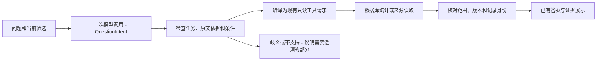

# 问题理解：中间表示最小版本

## 做了什么

增加一个可选入口：模型先把问题转换成结构化任务，再由程序调用现有只读工具。“中间表示”就是一份带字段的任务说明，例如统计什么、在哪个集合、用哪些条件。模型提供理解，数据库和原始材料提供答案。没有新增 SQL 生成器或数据库。



理解结果包含任务、集合、统计或检索参数、原文片段、共享条件和未解决事项。共享条件指定适用任务，解释性说明不会变成一个独立待完成任务。它们与任务请求一起进入审计。

程序只能调用事先定义的工具。原始公司或媒体名称须来自问题或当前筛选；已有工具负责规范名称和范围检查。数据读取不再逐次等待模型选择下一个工具。

## 当前支持

| 任务 | 程序行为 |
| --- | --- |
| 数量、分组、年份和并列最高 | 编译为 `record_statistics`，沿用现有统计逻辑 |
| 两个或三个明确时段 | 一次统计请求比较各时段，保留共同条件 |
| 单次内容检索或对象比较 | 编译为 `search_records`，再进入已有证据生成流程 |
| 按标题读取元数据、正文或来源 | 先 `find_records`，唯一命中后绑定记录、版本和正文哈希 |
| 两个或三个独立数据读取 | 逐项执行；保留已完成部分和未完成原因 |
| 缺少某个原始字段 | 沿用逐字段状态；已记录字段仍可展示 |

一个理解请求最多三个任务；程序最多六次数据工具读取，含标题定位。这个上限与旧规划器的四次工具上限分别记录。内容回答还可能调用已有生成、向量或联网组件，并不承诺整次回答只有一次模型调用。

原生广告与社交帖子分别计数。已收集帖子不能自动称为付费广告。当前筛选、日期口径、比例分母、来源版本和费用账本继续有效。

## 开启方法

服务器设置：

```text
OBS_QUESTION_INTENT_ENABLED=true
```

重启应用后，Query 的生成入口使用中间表示。此设置优先于旧规划入口；默认关闭，便于保留现有对照。真实模型调用仍需批准，不因配置而自动获得预算授权。本轮没有修改运行中的服务器配置或部署。

相关代码：`question_intent.py` 定义并编译任务，`intent_execution.py` 执行受控读取，`research_agent.py` 复用现有模型调用和预算，`service.py` 继续生成、展示与核对答案。

## 明确的限制

- 结构和原文匹配只能检查可定位性，不能证明模型没有误解日期、分组、字段或内容条件。
- 本版不组合内容生成与统计读取，不支持凭检索片段计算全库内容数量或完整名单。
- 知识图谱与 CLAIMS 仍由已有工具入口提供；本版中间表示没有新增图谱或分类执行任务。
- 名称没有唯一对应、标题没有唯一命中或条件无法表示时，会明确澄清。不会擅自扩大范围或选第一个候选。
- 预算、服务、来源变化和数据缺失保留各自原因；程序失败不会被解释为数据库未命中并自动触发联网。
- 客户24题不参与实现或调试。本轮只使用新虚构案例；真实理解准确率、费用表现和客户验收仍待独立验证。

## 工程验证

独立检查覆盖任务编译、共享条件、两时段、标题身份、范围变更、异常参数及预算失败。完整工程门禁的实际结果和排除范围记录在 `work.md`；单项检查不作为整轮完成依据。

2026-10-08固定候选完整门禁：4373通过、8跳过、0失败、0错误，Ruff和3份浏览器脚本通过。321个live／integration案例按标记排除，28个客户或依赖客户的旧模块保留保护。候选业务代码与本轮10份工作目录实现／测试一致；共用工具在候选中仅做导入顺序修正，原目录未改。该结果不证明仍在变化的原目录、运行网页或服务器通过。

本机审核目录：`.runtime/understanding_route_20261008/README.zh-CN.md`（不随源码发布）。其中保留自然语言示例、最终指纹、完整门禁、排除范围及失败记录。

Claude已于2026-10-08 19:13 UTC明确确认初始P55交接。最终实现／固定候选交接仍无单独确认。其后提出的实体别名匹配接入属于下一步协作任务，未进入本版冻结源码；模型仍应按本版规则使用问题原文中的名称。
