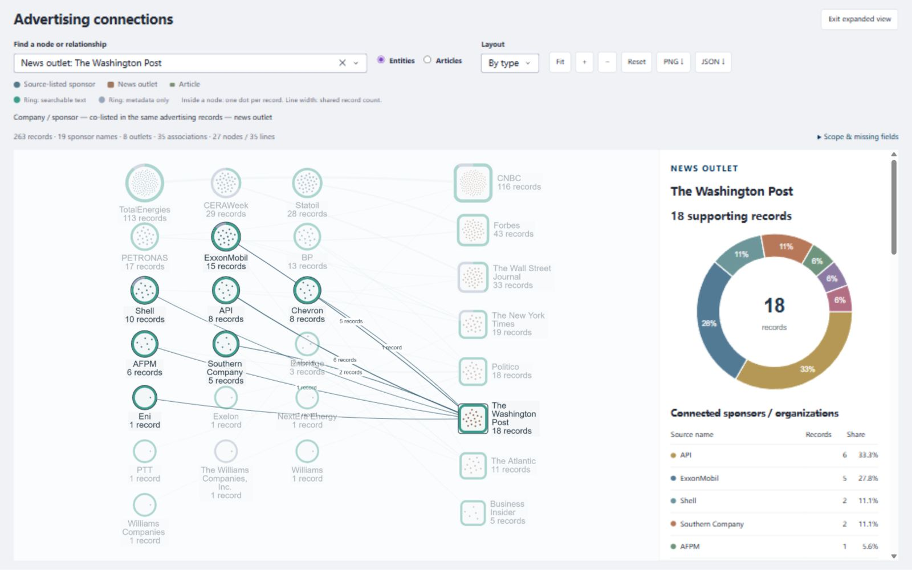

# 图谱对象详情第二版：客户问题、占比与原始记录

日期：2026-09-29（本机）。本次改动针对客户提供的六项研究问题和用户提供的 How Do They Lobby 截图。参考的是交互与视觉组织，未导入游说数据或赋予广告记录“支持／反对”立场。

## 已实现的使用路径

在 [本机 Data](http://127.0.0.1:8050/data) 的 Knowledge graph 中：

1. 点击图中公司／来源赞助方：查看其媒体分布环图、完整名单、每项记录数与占比。
2. 点击媒体：查看该媒体的来源赞助方分布；缺失赞助方单独计入分母，不制造 Unknown 企业实体。
3. 点击扇区、名单按钮，或键盘选择 **Show supporting records for**：右侧只显示该分类的文章。名称、数量、版本和成员均重新从服务器确认，不信任图中传回的数量。
4. 点击关系线：查看支持该关系的记录、按年份分布，以及这批记录占两端各自记录总数的比例。年份缺失单独列出。
5. 切换 **Articles**：展开当前对象／所选环图分类的确切文章；箭头标注 **Source lists sponsor** 或 **Published in**，每条路径可以回到具体记录。文章标题打开正文、原文及可用材料。
6. **Download counts** 导出当前对象的全部分类、精确源字段、计数、占比、分母和缺失标识。它不同于全图 JSON、当前可见 PNG，以及 Overview 的完整交叉表导出。

三个客户端例题有直接入口：ExxonMobil → publishers、Washington Post → sponsors、New York Times → count。它们使用当前筛选后的真实节点；若该对象不在当前范围，显示无匹配记录，不切回全库。

展开和切换视图后，画布会按实际可见尺寸自动显示并适配，无需手工 Reset。本次修复了隐藏画布尺寸为零时的缩放计算：关闭组件的比例响应计算，使用正尺寸检查与 200ms ResizeObserver 经 Dash 公开 Store 请求适配；保留已拖动的位置与当前选择。

## 图中标注的含义

| 标记 | 含义 |
| --- | --- |
| 圆形／圆角方形／小文章节点 | 来源赞助方候选／媒体／具体记录，形状与文字共同区分类型 |
| 实体内点阵 | 一个点对应一条当前展示范围内的记录；点阵是实体摘要，不是额外建立的关系节点 |
| 双颜色外环 | 有可检索正文／仅有元数据；不表示正文完整、广告立场、事实真假或 CLAIMS 判定 |
| 节点名称与数字 | 完整名称换行，数字是记录数。文章展开时显示展开子集的数字，完整范围计数另保留 |
| 实体之间的曲线 | 同一批来源记录共同列出赞助方与媒体；线宽表示共同记录数，选中后显示数字，无付款方向箭头 |
| 文章视图箭头 | 文章的具体来源字段关系，有明确方向与谓词标注 |
| 详情环图 | 当前选中对象的记录构成，所有分类都计入分母；颜色只用于该详情分类，不对应图中节点类型 |

保留精确来源类别，不自动合并 Williams 的不同名称。CERAWeek 的会议、API／AFPM 的协会提示显示在对象详情中；是否纳入客户的“公司”统计口径仍需确认。关系图证明来源字段关联，不独立证明商业合作。

## 逐项对应客户要求

| 客户问题 | 当前可用路径 | 本次推进与边界 |
| --- | --- | --- |
| Q1 公司 × 媒体数量比较 | Overview 全量带数字矩阵、计数表与 CSV；Knowledge graph 对象详情 | 补上对象占比和明细，保留完整计数；统计单位是合格收录记录，不是全市场广告或合同数量 |
| Q2 媒体有哪些赞助公司 | 点媒体节点 → 全部来源赞助方 → 对应文章 | 增加环图、名单点击、缺失类别和组织类型提示；来源赞助方可能包括协会与会议 |
| Q3 按日期、媒体、公司／赞助方比较 | 三视图共享筛选、年度柱图与 Unknown 日期；关系详情年份环图 | 所有比例、分类和明细沿用当前范围；不改写日期或把未知日期推定为年份 |
| Q4 数据支持的主题探索 | Overview 历史标签分布 → 点击条形或选标签 → 对应文章 | 本次新增下钻与分页。标签可以重叠，保留当前筛选的交集，不画成互斥主题饼图；仍是未核验历史自动标签 |
| Q5 社交广告探索 | 独立页面／适配器与 not connected 状态 | 真实社交导出缺失，不能生成有意义的图表与验收结果；保持缺失说明与接口 |
| Q6 有来源依据的双库 RAG | 既有模型理解 → 只读 MCP 数据工具 → SQL／正文引用路径 | 本次复核统计与来源入口，未调用付费模型。原生路径已有；社交真实输入和正式 CLAIMS 关联仍待接入 |

“哪些文章包含漂绿声明”需要经过确认的 CLAIMS 版本、codebook、文章／正文版本映射与证据定位。历史标签页面不能替代该交付。实现前差异见 [六项要求审计](CLIENT_REQUIREMENTS_GRAPH_V2_20260929.zh-CN.md)；正式接入边界见 [离线 CLAIMS／实时 RAG 方案](../docs/CLAIMS_OFFLINE_RAG_ONLINE_20260925.zh-CN.md)。

## 验证与可审查证据

- 最终非 integration／非 live 完整工程回归：**926 项通过，62 项排除，33.34 秒**。画布尺寸修复后另有 **118 项相关检查通过**。此前的 920 项完整检查和 143 项相关检查保留为历史阶段，后者包含实际隔离测试数据库检查；不把旧总数当作最新回归。`src`、`tests`、`scripts` 的 Ruff 检查与 `collection_graph.js` 的 Node 语法检查通过。
- [只读真实库核对](graph_breakdowns_smoke_20260929.json)：8 个筛选范围、88 个实体占比分区、1,314 个关系详情；分类计数与同范围 SQL 交叉表一致。缺失值分母、文章子集和外环／点数均检查。
- 本机实际浏览器操作确认：点击 Washington Post 节点显示 18 条／7 个所列赞助方类别；环图扇区、名单点击及 Enter 选择均能下钻对应记录。选择 ExxonMobil 得 5 条；Articles 展开为 5 条文章、7 个节点、10 条源字段边。NYT 快捷入口返回 19 条。正文详情在新标签中打开，存储正文、来源与 PDF 未核验说明可读。
- 历史标签下拉框选择 **Decreasing emissions** 显示 84 条匹配记录；点击 **Petrochemical product** 条形显示 40 条。它们仍是历史自动标签，不是新确认的主题或漂绿结论。
- 展开画布空白修复后，刷新并展开会自动渲染。390×844 窄屏下文档实际可用宽和滚动宽均为 375px，环图与完整四行分类可读；桌面 1600px 与窄屏测试的临时视口配置均已恢复。浏览器错误日志为空。具体状态和截图见 [验证汇总](graph_details_v2_validation_20260929.json)。
- 导出内容通过回调检查；NYT 对象导出在网页显示 **Prepared 5 categories for 19 supporting records.** 未捕获浏览器下载文件字节，不把准备成功当作文件字节核验。
- 默认范围的已核对例子：NYT **19**；ExxonMobil **15／4 家媒体**；Washington Post **18／7 个来源赞助方类别**；ExxonMobil × Washington Post **5**。
- 275 条收录、263 条合格记录、226 条可检索记录、556 个句界片段保持不变。源数据及索引版本在只读核对前后相同，本轮模型调用 **0**。

当前实现可供本机试用；本轮未推送 GitHub 或更新 Railway。工程、计数与页面检查不替代客户验收、分类语义核验或线上完整使用测试。

## 实际界面截图

桌面响应式检查中的 Washington Post 详情：

- [390×844 窄屏环图与分类](screenshots/graph_details_v2_mobile_20260929.jpg)
- [正文与来源详情](screenshots/graph_details_v2_record_20260929.jpg)
- [历史标签文章下钻](screenshots/graph_details_v2_historical_theme_20260929.jpg)
- [当前默认窄侧栏窗口](screenshots/graph_details_v2_final_20260929.jpg)

截图证明保存时的界面状态，不代替原文质量、附件内容或标签语义核验。

## 可维护的实现入口

| 文件 | 用处 |
| --- | --- |
| [collection_graph_breakdown.py](../src/observatory/collection_graph_breakdown.py) | 服务器端分区、分母、缺失类别、关系两端占比与 Plotly 环图 |
| [collection_graph_visual.py](../src/observatory/collection_graph_visual.py) | 使用现有 Cytoscape 画布与 SVG 背景图，真实点阵、外环、类型和关系标签 |
| [collection_graph_ui.py](../src/observatory/collection_graph_ui.py) | 规范 ID 选择、环图／名单／记录联动、范围和导出 |
| [collection_graph.js](../src/observatory/assets/collection_graph.js) | 可见正尺寸观察、延迟适配与 Dash 公开状态接口；展开和隐藏视图不再产生零尺寸比例计算 |
| [historical_theme_ui.py](../src/observatory/historical_theme_ui.py) | 当前筛选内历史标签的确切记录交集与分页 |
| [check_graph_breakdowns.py](../scripts/check_graph_breakdowns.py) | 无模型调用的真实数据检查，可用于后续数据增量回归 |

没有新增图数据库、图形框架或多 agent 运行依赖。来源图谱、SQL 统计、既有记录详情及模型工具接口继续复用。
