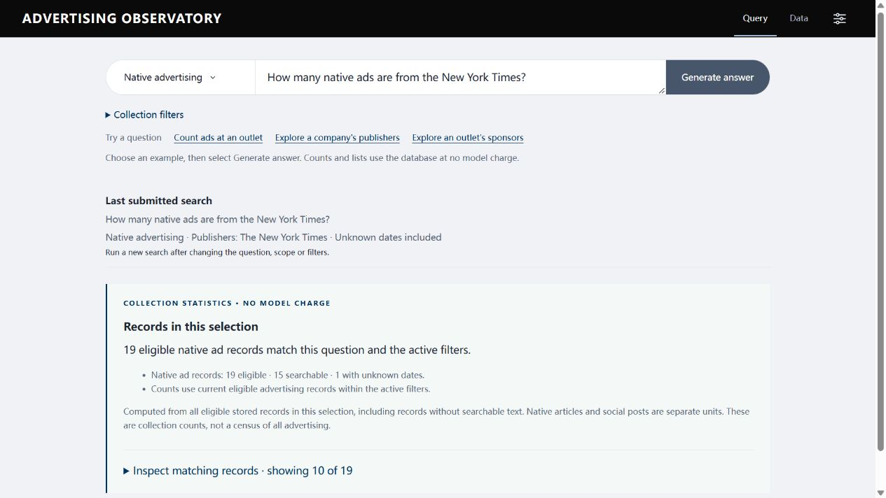
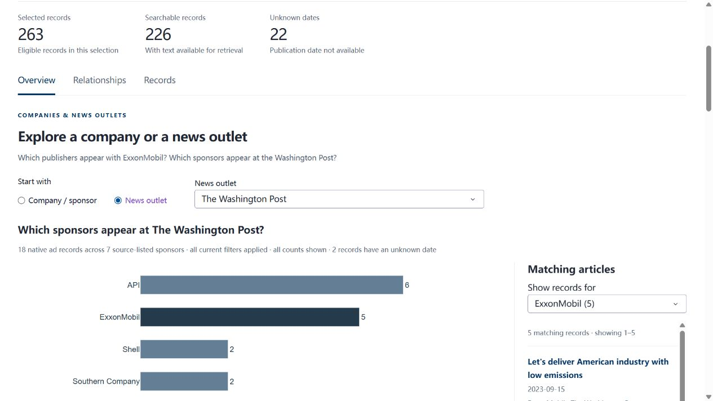

# Michelle 反馈修正：本机实现与试用

日期：2026-09-29。代码在本机运行；GitHub 和 Railway 尚未更新。这份报告对应[六项要求审计](MICHELLE_FEEDBACK_AUDIT_20260929.zh-CN.md)，不是客户验收。

## 本轮改变

1. **Data → Overview：公司／赞助方 ↔ 媒体。** 切换 Company / sponsor 和 News outlet，选择一个名称，看到所有对应类别的横向条形图与直接标出的数量。默认公司为 ExxonMobil；切换媒体方向默认 The Washington Post。完整矩阵仍用于多对象比较。横向条形图支持名称和数量的直接比较；饼图不作为默认视图。
2. **记录放在图旁边。** 点击条形或选择 Show records for，查看对应文章；10 条一页，标题进入正文和来源详情。全局筛选变化清除旧的子选择。全量分类计数不受记录分页影响。
3. **Query：字段统计直接查数据库。** 三个示例按钮仅填入问题；点击 Generate answer 才提交。数量与对象名单不使用模型、向量、片段 Top K 或 API 预算。输出明确标注 Collection statistics · no model charge，包含实际筛选、可统计／可检索／未知日期数量，以及可打开的匹配记录示例。正文解释保留原有 RAG。
4. **范围不会暗中变大。** 问题中的媒体、赞助方和显式日期与当前筛选取交集；名称不存在、别名对应多个类别、范围冲突或相对日期无法明确解析时要求澄清。别名只帮助找到原分类，不合并公司身份。主题、漂绿数量及无明确分母的百分比不自动生成确定结果。

## 直接试用

- [Data](http://127.0.0.1:8050/data)：Overview → Company / sponsor → ExxonMobil，查看 4 家媒体；再切换 News outlet → The Washington Post，查看 7 个来源赞助方类别。点 ExxonMobil 条形后应看到对应的 5 条文章。
- [Query](http://127.0.0.1:8050/query)：选择 Count ads at an outlet，然后 Generate answer，返回 NYT 19 条；另外两个示例分别展示完整媒体和赞助方计数表。
- 修改日期、媒体或 sponsor 后重新提交，结果保留原筛选与新增条件的交集。例子不会替用户清空筛选，也不会自动付费。

## 当日真实数据结果

默认范围：native、无对象和日期限制、包含未知日期。全库 263 条可统计记录、226 条可检索正文、22 条未知日期。

| 任务 | 结果 |
| --- | --- |
| NYT 广告数 | 19 条；15 条可检索正文，1 条未知日期 |
| ExxonMobil 媒体 | Business Insider 5；Washington Post 5；New York Times 3；Wall Street Journal 2。15 条、4 类媒体 |
| Washington Post 赞助方 | API 6；ExxonMobil 5；Shell 2；Southern Company 2；AFPM、Chevron、Eni 各 1。18 条、7 个来源类别 |

统计包含没有可检索正文的记录。计数依据当前 stored source sponsor 字段；不是该媒体所有真实广告的普查，也不独立证明赞助身份或商业合同。协会、活动与公司可能共存，公司研究口径仍需确认。

## 验证

- 实际数据库只读检查：[统计问答回执](michelle_statistics_smoke_20260929.json)，三个客户例子、显式年份、当前总量、漂绿数量拒答均无模型调用；查询前后数据版本一致。
- 浏览器操作确认两个方向、Washington Post → ExxonMobil 的 5 条文章、三个 Query 示例、完整统计表及源记录入口。未发起真实模型请求。
- 自动测试：完整回归 **732 项通过**（58.25 秒），Ruff 通过；详见[本轮验证回执](michelle_implementation_validation_20260929.json)。范围覆盖动态名称、日期、冲突筛选、未知值、非正文记录、跨库计数单位、超过 Top 10 的全量输出、链接开关和故障处理。它们是工程与统计验证，不证明领域标签、RAG 语义或用户体验已经通过客户验收。

## 仍需完成

正式社交导出与字段含义、权威数据版本与公司／协会统计口径、主题／CLAIMS taxonomy 与审核责任，以及客户对操作和研究含义的验收。客户已给出基础问题，不需等待更多题目才修复本轮功能。CLAIMS backend 集成仍按原项目范围留待后续，除非 PM 确认本期变更。剩余材料与未发送的英文回复见[反馈审计](MICHELLE_FEEDBACK_AUDIT_20260929.zh-CN.md)。
