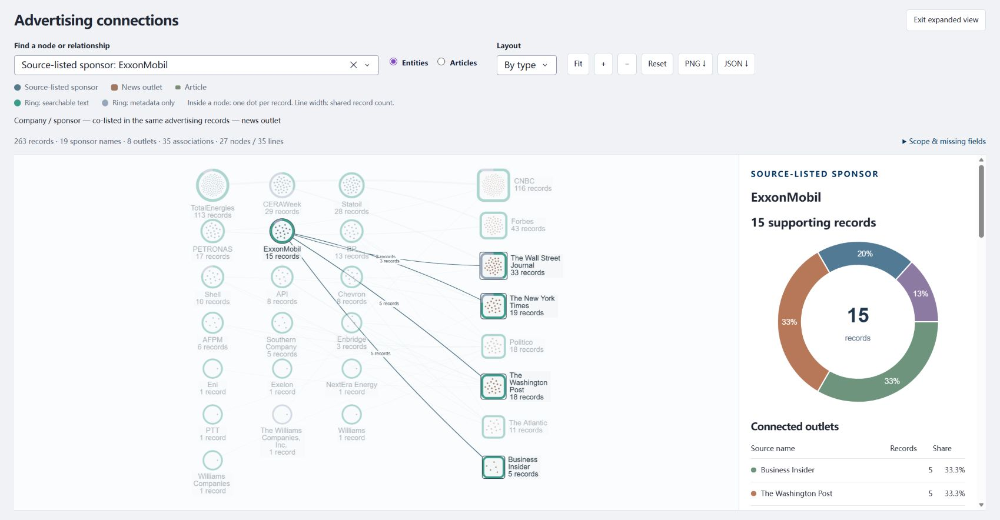

# 0.4.0／0.4.1 发布与交接验证

日期：2026-09-30（America/New_York）。状态：**0.4.1 已发布到 GitHub／Railway，本机同步完成**。首屏图谱和互动已核对；0.4.0 的三道客户问题与性能基准保留其版本范围。独立客户验收未完成。

## 交付内容

原生广告 Data 的大幅来源图谱、明确关系与来源说明、公司／媒体占比环图、可点击名单和文章；Overview 的全量矩阵、双向统计探索、日期／历史标签分布；Records 分页与正文／来源详情。Query 用语言模型选择受限工具，SQL 回答全量数量与名单，RAG 回答正文内容。可选 MCP 复用相同只读工具。

代码含默认 upsert 的 canonical 导入、有序迁移和可重复准备／发布的检索 profile。Docker 安装锁定依赖和非 editable 包，CI 验证实际 wheel 中的资源与迁移。健康接口返回应用版本、合法部署提交和功能开关，不暴露配置。

## 已执行验证

- 0.4.0 安装制品完整离线回归：952 passed、62 deselected（Python 3.13.3），没有跳过 wheel 检查；Ruff、浏览器 JS 语法和配置解析另已通过。该数字属于工程回归，不是答案准确率。先前源码环境的 artifact 检查被护栏拒绝，因为它从 editable checkout 导入；改到真正的 wheel 安装环境后全套通过，没有放宽测试。
- 当前 0.4.1 安装制品：本机 Python 3.13.3 为 956 passed、62 deselected／45.43 秒；GitHub Python 3.12 为 956 passed、62 deselected、3 warnings／55.66 秒。新增四项验证空画布时 resize／selection 回调恢复，已有画布保持位置。
- [干净环境离线复现](current_release_offline_reproduction_20260929.json)：Python 3.12.14、0.4.0、81 个锁定 runtime/MCP 依赖、50 个包文件和 41 个模块；没有从源码目录导入。
- [实际数据库复现](current_release_database_reproduction_20260930.json)：仅本机 obs_test 的独立随机 schema；迁移至版本 2 并重复运行，两年追加保留，重复导入 unchanged；6 个片段原文定位正确，3 个不同正文散列缺向量，激活被阻止；模型、回答和用量表为空。
- 本机托管进程已更新依赖并重启，/healthz 显示 0.4.1、图谱／占比／研究工具开关启用，275 条 native 和 556 片段以及源数据／索引标识与更新前一致。本机没有平台提交变量，commit=null；生产提交另核对。

[37,000 条合成记录基准](dashboard_performance_baseline_20260930.json)已完成：实际写入 37,000 records／versions／annotations，7 种现有数据库方法各 15 次测量。Dashboard p95 921 ms，首／中间 50 行分页 p95 319／284 ms。全量图谱元数据约 18.76 MiB，尚未测图谱构建、HTTP 传输、浏览器、并发和云端。完整方法与限制见[性能基线说明](../docs/PERFORMANCE_BASELINE.md)。它不是正式社交数据或客户 SLA 验收；测试 schema 已清理。

## 发布设置与线上验证

Railway 实际服务设置已应用：Wait for CI、发布前 `/app/.venv/bin/observatory migrate`、`/healthz` 和 60 秒 timeout、`OBS_RESEARCH_AGENT_ENABLED=true`。不假定 railway.json 自动生效；设置、部署成功及 health 已核对。0.4.1 部署前日志显示 initialized=true、current_version=2、pending=[]，两个迁移均 applied。未修改现有预算或凭据；收录数、片段和源／索引标识相同，不以健康摘要声称全部生产向量逐字节对账。

0.4.0 已推送提交 `0f1433d1ddb8d6f8df7c3e064518e7aeff059891`，GitHub [CI 36668185271](https://github.com/yaobc77-ai/ciss-advertising-observatory/actions/runs/36668185271) 实际 952 passed；Railway 应用配置部署 `f80c882f-2d42-45fc-81ce-18e3d57e9838` 成功，健康接口显示该提交及三个 feature=true。更新前生产健康快照见[发布前回执](release_v0_4_0_preflight_20260930.json)。

## 尚需客户材料和验收

1. 正式社交数据及字段说明、数据版本与维护负责人。
2. 公司／赞助方／会议／协会的身份映射、统计资格与跨年更新规则。
3. 代表性问题、独立标准答案和真实用户测试；已有三个客户问题是开发与试用任务，不是独立测试集。
4. 可公开原始材料、归档映射与核验；当前仅一份本地 PDF 已核验。正式 CLAIMS 需要批准的 taxonomy、版本和文章关联，保留接口，不能以历史自动标签冒充完成。

本次工程验证不证明生成语义、跨机全库恢复、生产向量字节等价或 37,000 节点浏览器可用。历史审计与回执保留其原日期和范围。

## 线上问答与首屏图谱修复

[三道生产问题回执](release_v0_4_0_production_questions_20260930.json)记录0.4.0的真实浏览器检查：NYT 19／15可检索；ExxonMobil 15条、4媒体（5／5／3／2）；中英混合 Washington Post 问题返回18条、7赞助方类别（6／5／2／2／1／1／1）。每题1次模型解释，总界面费用约 $0.00164，未独立核对生产账本；数量和名单由 SQL 计算，未用生成答案数数。已知客户例题仅是 smoke，不是独立语义评价。

首次实际截图发现空画布，但旁栏和环图正常；Reset 后图谱恢复。可能的触发是后发尺寸／选择回调覆盖初始数据回调，最终保留空 elements。0.4.1 已将公开 canvas.elements 作为 State，仅检查是否为空；空时从服务端已验证的数据重建，有内容时保留 no_update 和用户拖动位置。没有修改计数、原文、索引、布局参数或预算。新增 4 项初次 resize／selection 回归；[0.4.1 独立制品与数据库复现](current_release_database_reproduction_v0_4_1_20260930.json)通过，0.4.0 历史回执保留。

## 0.4.1 实际生产检查

源码修复提交 `3ee1731d2fc6cf823840847a14ff18f078c9cd19`，[CI 36669373399](https://github.com/yaobc77-ai/ciss-advertising-observatory/actions/runs/36669373399) 成功；Railway 部署 `eccd733e-c159-4fdb-a170-b33013f6a16f` 为 active／successful，health 返回 0.4.1 和该提交。完整白名单、分母及检查范围见[生产发布回执](release_v0_4_1_publication_20260930.json)。随后文档提交可引起同版本重部署；本回执固定于完成实际浏览器检查的源码提交。

首次导航到 Data 后，无需 Reset 或 Fit 即显示 27 节点／35 条关联。展开图谱仍正常；直接点击 ExxonMobil 和 Washington Post 节点，分别得到 15 条／4 媒体和 18 条／7 赞助方类别。ExxonMobil 媒体表中点击 Washington Post，旁栏列出对应 5 条；标题打开独立详情页，显示存储正文、原文链接及附件缺失状态。本次点击的记录没有核验 PDF／截图，未把缺失材料记作来源交付通过。

[实际导出的 ExxonMobil 数量 CSV](release_v0_4_1_exxonmobil_counts_20260930.csv) 为 4 行，数量 5、5、3、2，分母均 15。PNG 下载成功，1846×906，已查看内容；它是带透明背景的图谱导出，不包含旁栏环图或计数表。自动化 download 事件等待超时，但实际浏览器下载文件存在并经读取核对，未将事件超时当成应用导出失败。

首屏证据：[无需重置的图谱](screenshots/release_v0_4_1_graph_first_load_20260930.jpg)。展开证据：

0.4.1 只改空画布恢复，未改研究工具或模型路径，因此保留 0.4.0 三道真实付费问题回执；补丁后没有追加付费调用，也不把工程回归当作生成语义评价。
